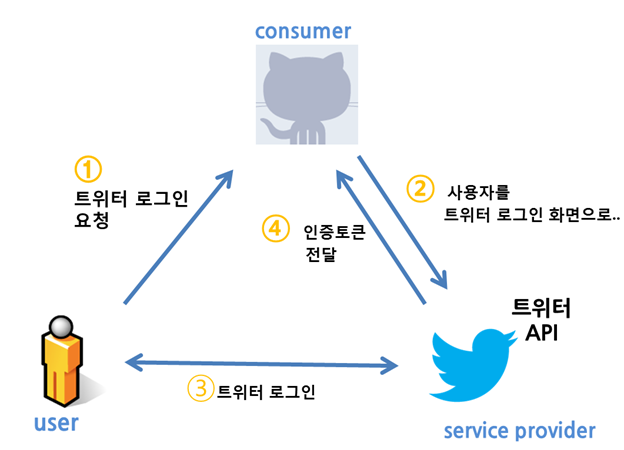

# 12. 기본 인증

# 웹 환경에서의 인증(Authentication)과 인가(Authorization)

- 인증 : 인터넷에서 사용자의 신원을 확인하는 행위.
    - `누구인지`를 검증하는 단계.
    - 경찰이 면허증을 통해서 신원을 확인하는 행위
- 인가 : 인증된 사용자가 특정 자원이나 기능에 접근할 수 있는 권한을 확인하고 부여하는 과정.
    - `무엇을` 할 수 있는지를 결정하는 단계
    - 대리운전 시, 운전기사에게 나의 자동차 키를 넘겨줘서 운전을 하도록 하는 행위

## OAuth 적용 사례

- SNS 로그인에서 해당 프로토콜 사용

<br>

# OAuth 1.0

| 용어 | 설명 |
| --- | --- |
| 사용자(user) | 서비스 제공자와 소비자를 사용하는 계정을 가지고 있는 개인 |
| 소비자(consumer) | Open API로 개발된 OAuth를 사용하여 서비스 제공자에게 접근하는 애플리케이션 |
| 서비스 제공자(service provider) | OAuth를 통해 접근을 지원하는 애플리케이션 |
| 소비자 비밀번호(consumer secret) | 서비스 제공자에게 소비자임을 인증하기 위한 키 |
| 요청 토큰(request token) | 소비자가 사용자에게 접근 권한을 인증받기 위해 필요한 정보가 담겨있는 토큰 |
| 접근 토큰(access token) | 인증 후 사용자가 서비스 제공자가 아닌 소비자를 통해서 자원 접근을 허락하는 키를 갖고있는 토큰 |

### 흐름




1. 소비자가 서비스 제공자에게 요청 토큰을 요청한다.

2. 서비스 제공자가 소비자에게 요청 토큰을 발급해준다.

3. 소비자가 사용자를 서비스 제공자로 이동시킨다. 여기서 **사용자 인증이 수행**

4. 서비스 제공자가 사용자를 소비자로 이동시킨다.

5. 소비자가 접근 토큰을 요청한다.

6. 제공자가 접근 토큰을 발행한다.

7. 발근된 접근 토큰을 이용하여 소비자가 사용자 정보에 접근한다.

### 문제점

- Scope 개념 없음
- 역할이 확실히 나누어지지 않음
- 토큰 유효기간 문제
- Client 구현 복잡성
- 제한적인 사용 환경

<br>

# OAuth 2.0 (가장 많이 쓰이는 인가 프로토콜 버전)


| 용어 | 설명 |
| --- | --- |
| Resource owner | 사용자 |
| Client | Resource Server에서 제공하는 자원을 사용하는 애플리케이션 |
| Resource Server(API Server) | 자원을 호스팅하는 서버 |
| Authorization Server | 사용자의 동의를 받아서 권한을 부여하는 서버, 일반적으로 Resource Server와 같은 URL 하위에 있는 경우가 많음 |

## 추가된 기능

- 스코프 기능 추가
    
    
    
    - 1.0은 토큰이 있으면 모든 리소스에 접근 가능.
        
        → 2.0에서는 스코프 기능을 추가해서 해당 토큰에 대해서 얼만큼의 접근 범위가 있는지 알 수 있게 됨
        

- Authorization/Resource Server의 선택적 분리


- Authorization Server
    - Resource Owner 인증
    - 인가 토큰 발급
- Resource Server
    - 보호된 리소스 관리

- 클라이언트 복잡성 간소화
    
    
    
    - Bearer Token + TLS 로 해결.
        - 모두 배제하고 토큰을 소유하고 있는 것만으로도 권한을 인정해줌.
        - TLS → HTTPS 강제
- 토큰 탈취 문제 개선
    - 1.0은 6개월, 1년 정도의 엄청나게 긴 유효기간이 있어서 오랜기간 어뷰징 가능
    - 이로 인해 refresh token 개념을 추가
    - 유효기간이 매우 짧은 access token으로 접근하고 refresh token 으로 갱신
- 제한적인 사용 환경
    - 웹 브라우저 환경 외에서 사용이 어렵다.
    - 이로인해 Grant 라는 개념을 추가.

## Grant


### Authorization Code


**흐름**


1. 권한 부여 요청
    - 클라이언트는 사용자를 인증 서버로 리디렉션하여 Authorization Code를 요청.
    - 사용자는 인증 서버에 로그인하고, 요청을 승인.
    - 인증 서버는 클라이언트에 권한 Authorization Code를 반환.
2. Authorization Code 교환
    - 클라이언트는 Authorization Code를 사용해  Access Token을 요청.
        - 이 요청에는 Client ID, Client Secret, Authorization Code가 포함
    - 인증 서버는 요청을 검증하고, Access Token을 발급

**장점**

- Access Token이 클라이언트 측에서 직접 노출되지 않는다.
- Refresh Token을 지원한다.
- Client Secret을 사용하여 보안을 강화할 수 있다.

**단점**

- 구현이 복잡하다.
- 사용자의 상호작용이 필요하다.


**사용사례**
- SSO 에서 사용되는 보편적 OAuth 방식
- [WEB2 - OAuth 2.0 : 1.수업소개](https://youtu.be/hm2r6LtUbk8?si=4IkJVuO3u7yjoKm7)
- [🌐 OAuth 2.0 개념 - 그림으로 이해하기 쉽게 설명](https://inpa.tistory.com/entry/WEB-📚-OAuth-20-개념-💯-정리)

### Implicit


흐름

1. **권한 부여 요청**:
    - 클라이언트는 사용자를 인증 서버로 리디렉션하여 Access Token을 요청.
    - 사용자는 인증 서버에 로그인하고, 요청을 승인.
    - 인증 서버는 클라이언트에 Access Token을 반환.

**장점**

- 비교적 간단한 흐름으로, 클라이언트에서 직접 Access Token을 받을 수 있다.
- 서버 측 코드 교환이 필요 없다.
- OAuth1.0과 가장 비슷한 인증 방식으로, OAuth 2.0에서 가장 많이 사용되는 방식

**단점**

- Refresh Token을 지원하지 않는다.
    - back channel이 없으므로 `refresh token` 도 사용하지 못한다.
- Authorization Code 없이 바로 발급되어 보안에 취약하다.

**사용사례**

- 주로 Read Only인 서비스에 사용된다.
- Client Secret을 기밀로 유지할 수 없는 시스템 (서버측 구성요소가 없는 시스템)
    - Javascript Application, Mobile Application은 안전한 저장 공간이 없음.
- OAuth 서버가 CORS (Cross-Origin Request)를 지원하지 않는 경우
    - Authorization code에서는 JavaScript 응용 프로그램이 권한 서버에 POST 요청을 하도록 요구하므로 OAuth 서버는 브라우저가 해당 요청을 수행 할 수 있도록 적절한 CORS 헤더를 지원해야 한다.
    - 본인이 OAuth 서버를 작성하는 경우 상대적으로 쉬운 변경이지만, 기존 서버를 사용하는 경우 이 유형을 사용하여 CORS 제한을 피할 수 있다.

### Resource Owner Password Credentials


**흐름**

1. **Access Token 요청**
    - 클라이언트는 사용자 자격 증명(사용자 이름과 비밀번호)을 사용하여 인증 서버에 Access Token을 요청
    - 인증 서버는 요청을 검증하고, Access Token을 발급.

**장점**

- 구현이 쉽다.
- 사용자 상호작용이 불필요하다.

**단점**

- Refresh Token을 지원하지 않는다.
- 사용자 정보(ID/PW)가 노출될 위험이 높다.
- HTTPS를 사용해도 사용자의 비밀번호가 클라이언트에 전달되기 때문에 권장되지 않는다.

**사용사례**

- 사용자가 신뢰할 수 있고 위험이 낮은 경우에 사용된다.

### Client Credentials


**흐름**

1. Access Token **요청**
    - 클라이언트는 자신의 자격 증명(Client ID와 Client Secret)을 사용하여 인증 서버에 Access Token을 요청.
    - 인증 서버는 요청을 검증하고, Access Token을 발급.

**장점**

- 구현이 쉽다.
- 사용자 상호작용이 불필요하다. (사용자 개입 없이 서버 간에 직접 토큰을 발급)
- 클라이언트 자격 증명을 사용하여 보안성이 높다.

**단점**

- Refresh Token을 지원하지 않는다.
- 사용자 별로 제어하지 않아도 된다.

**사용사례**

- M2M(Machine to Machine, Backend Server To Backend Server) 통신
- 서버간 통신 (API)

<br>

# OAuth 2.1


금융권, 증권시장, 의료계 등의 보안이 더 민감한 사용처로 인한 보안의 중요성

(2.0은 간략화를 위해 조금의 보안을 포기한 트레이드 오프가 있었음)

- OAuth 2.0과 RFC 보안책들을 하나로 뭉쳤다.


<br>

## Grant

- Implict 및 Resource Owner Password Credential 제거
    - 더 이상 권장되지 않으며, 명시적으로 제거. 보안상의 이유로, 액세스 토큰이 URL 프래그먼트로 전달되어 잠재적인 노출 위험이 있기 때문.
- Device Authorization Grant가 추가.

### Device Authorization Grant

IoT 기기 같은 제한된 디바이스에서 사용하기 위해,

다른 스마트 기기를 사용해서 인증 플로우를 할 때 기기를 바꿔 인증할 수 있는 플로우.


**흐름**

1. 클라이언트 애플리케이션은 디바이스 코드와 사용자 코드를 요청.
2. 사용자는 별도의 장치에서 사용자 코드를 입력하여 인증을 완료.
3. 인증 서버는 사용자가 인증을 완료하면 클라이언트에 액세스 토큰을 발급.

**장점**

- 입력 장치가 제한된 디바이스에서 효과적으로 인증을 수행 가능
- 사용자가 다른 장치에서 인증할 수 있어 편리

**사용사례**

- Netflix, YouTube 등 앱을 스마트 TV나 셋톱박스에서 접근할 경우, 인증 코드를 요구

<br>

## PKCE **(Proof Key for Code Exchange)**

- 권한 부여 코드 그랜트(Authorization Code Grant)에서 필수적으로 사용된다.
- Client Secret이 없는 공개 클라이언트(public client)와의 통신을 보호하기 위한 추가적인 보안 레이어.
- 검증값의 탈취 문제를 해결하기 위해 추가되었다.


**흐름**

1. Authorization code flow 시작시 클라이언트가 랜덤값(code_verifier)에 대한 Hash(code_challenge)와 code_challenge_method를 인가 서버에게 보낸다.
    - **code_verifier :** 인증 코드(code)를 가로채지 못하도록 하는 임의의 Random key
    - **code_challenge :** `code_verifier` **값을** `code_challenge_method` **로 Hashing 한 값**
    - **code_challenge_method :** `code_challenge`를 어떤 방식으로 변환할 것인지를 지정
        - 보통 SHA256을 뜻하는 S256이 들어감.
2. 액세스 토큰 요청을 보낼 때, Authorization code와 해당 해쉬값의 원문(code_verifier)을 같이 보낸다.
3. 완료 요청과 동시에 확인값 원문을 보낸다.

- **PKCE가 공격을 방지할 수 있는 이유**
    
    
    
    1. **code_challenge 전송 :** 클라이언트는 인증 요청(`/authorize`)을 보낼 때 `code_challenge`를 인증 서버에 전송한다. 이 단계에서 `code_challenge`는 공개될 수 있으며, 이것 자체로는 보안 위험을 초래하지 않습니다.
    2. **Callback code 시** : 사용자가 인증을 완료하면, Authorization Server는 클라이언트에게 `code`를 반환한다. 이 코드는 일반적으로 리다이렉션을 통해 클라이언트에게 전달되며, 이 과정에서 공격자가 인증 코드를 가로챌 가능성이 있다.
    3. **code_verifier의 역할**: 공격자가 `code`를 가로챘다고 해도, `code_verifier`가 없다면 액세스 토큰을 얻을 수 없다. `code_verifier`는 클라이언트가 보유하고 있으며, `/token` 요청 시에만 인증 서버에 전송된다. 이 단계에서 `code_verifier`는 암호화되거나 보호되는 채널을 통해 전송되므로, 공격자가 이를 가로채기는 매우 어렵다.

- **PKCE 관련 블로그 글**

    [https://medium.com/@itsinil/oauth-2-1-pkce-방식-알아보기-14500950cdbf](https://medium.com/@itsinil/oauth-2-1-pkce-%EB%B0%A9%EC%8B%9D-%EC%95%8C%EC%95%84%EB%B3%B4%EA%B8%B0-14500950cdbf)

<br>

### BCP: Refresh Token 회전 방식


- 스마트 환경에 맞아 보다 더 안전하고 다양하게 적용할 수 있게 확장
- 리프레시 토큰이 일회성이 되어서, 리프레시 토큰을 사용해서 새로운 액세스 토큰을 발급받으면 기존 리프레시 토큰은 사용할 수 없게되고 새로운 리프레시 토큰을 발급받는 회전 방식을 채택

### 그 외 OAuth 2.1 BCP에 포함된 보안 사항

- Redirect URI 패턴 매칭 스펙 아웃, 정확한 매칭 강제
- URI Query String 에서 Bearer token 사용 불가
- mTLS 또는 DPoP(암호학적으로 토큰을 Client에 종속) 채택
- 그 외 자주 발생하는 버그들에 대한 보완 스펙

<br>

## OIDC(OpenID Connect)


- OAuth 2.0을 기반으로 한 인증 프로토콜로,사용자 인증과 관련된 추가 정보를 제공하는 레이어
    - OAuth는 Authorization을 위한 기술이지 Authentication을 위한 기술은 아님.
- OAuth 2.0 + JWT기반 ID Token 인증
    - OAuth에서 발급하는 Access Token은 일시적으로 특정 권한을 허가해준 토큰일 뿐, 사용자 정보는 담고 있지 않는다.
    - Access Token을 발급하기 위해 사용자 인증을 하긴 하였으나, **Access Token이 사용자 인증을 위해 사용되어선 안 된다.**
    - **인증**을 위해 `ID Token` 추가.

### ID Token

- 사용자의 인증 정보를 포함한 JSON 웹 토큰(JWT).
- 사용자 ID, 인증 시점, 토큰의 발행자, 클라이언트 ID 등의 정보를 포함
- 포함된 내용
    - 토큰 발급자
    - 토큰 발급 시간
    - 토큰 사용자 (Client 식별자)
    - 사용자 식별자
    - 토큰 만료 시간

### OIDC 장점

- 직접적으로 ID 토큰을 파싱하고 안에 있는 서명값을 검증함으로써, API call을 하지 않고도 사용자에 대한 정보를 가져올 수 있다.

### OAuth2.0 vs OIDC

|  | OAuth2.0 | OIDC |
| --- | --- | --- |
| Format | JSON | JSON |
| Authorization | O | X |
| Authentication | Pseudo-authentication (OAuth로 인증 하는 것) | O |
| Best Suited for | API authorization | SSO for consumer apps |
- **Pseudo Authentication**
    - Auth로 인증 프로토콜을 구축하는 것은 가능하나, 여러 보안 위협들이 존재.

<br>

## 요약


**참고**

[[NHN FORWARD 22] 로그인에 사용하는 OAuth : 과거, 현재 그리고 미래](https://youtu.be/DQFv0AxTEgM?si=mZU9pGzMflwKswjy)

<br>

# base64 (URL-safe)

- URL-safe Base64 인코딩은 일반 Base64 인코딩과 다르게, URL에서 문제를 일으킬 수 있는 문자를 피하기 위해 특수 문자를 다른 문자로 대체한다.
    - **문자 대체**
        
        일반 Base64 인코딩에서 사용되는 **`+`**와 **`/`** 문자는 URL에서 특별한 의미를 가질 수 있어서, 아래와 같이 대체가 필요.
        
        - **`+`** → **``**
        - **`/`** → **`_`**
        - **`=` → 제거**
    - **패딩 처리**
        
        일반 Base64 인코딩은 4의 배수가 되지 않을 경우 **`=`** 문자를 사용하여 패딩을 추가한다.
        
        URL-safe Base64에서는 이 패딩 문자를 생략할 수 있어서, 디코딩할 때는 이 패딩이 추가되어야 할 수 있다.
        
- URL-safe Base64 디코딩 시에는 **``**, **`_`** 문자를 각각 **`+`**, **`/`**로 되돌리고, 패딩 문자를 추가해야 한다.

- Java의 경우, Java 8 이후로는 **`java.util.Base64`** 클래스가 이를 간편하게 처리할 수 있게 해준다.
    
    ```java
    // URL-safe Base64 인코딩
    String originalString = "OriginalString";
    String urlSafeBase64String = Base64.getUrlEncoder().encodeToString(originalString.getBytes());
    System.out.println("Encoded String: " + urlSafeBase64String);
    
    // URL-safe Base64 디코딩
    byte[] decodedBytes = Base64.getUrlDecoder().decode(urlSafeBase64String);
    String decodedString = new String(decodedBytes);
    System.out.println("Decoded String: " + decodedString);
    ```
    

- **Base64 인코딩 원리 관련 블로그**
    
    [https://dokhakdubini.tistory.com/505](https://dokhakdubini.tistory.com/505)