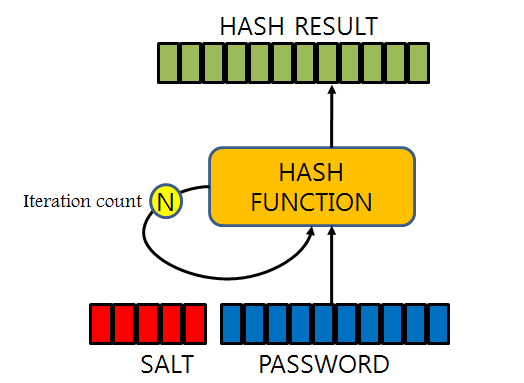

# 13. 다이제스트 인증

## SHA256 (Secure Hash Algorithm 256-bit)

암호화 해시 함수. 데이터 무결성 검증과 디지털 서명, 암호화된 메시지 인증 코드 등에서 널리 사용된다.



### 해시의 특성

- **고정된 출력 길이**
    - 입력 데이터의 크기에 관계없이 항상 256비트(16진수로 64바이트)로 64자리의 해시 값을 생성.
- **단방향 함수**
    - 해시 값을 통해 원래 입력 데이터를 역추적하는 것이 사실상 불가능하다.
- **충돌 저항성**
    - 두 개의 다른 입력이 동일한 해시 값을 가지는 충돌을 찾는 것이 매우 어렵다.
    - SHA-1의 경우, 2017년에 해시충돌이 발견된 후로 SHA-2 이상의 알고리즘으로 변경되면서 사실상 퇴출당했다.
        - [https://security.googleblog.com/2017/02/announcing-first-sha1-collision.html](https://security.googleblog.com/2017/02/announcing-first-sha1-collision.html)
        - [https://www.lgcns.com/blog/cns-tech/security/23851/](https://www.lgcns.com/blog/cns-tech/security/23851/)
- **고속 연산**
    - 효율적이고 빠른 해시 함수로, 다양한 애플리케이션에서 실시간으로 사용될 수 있다.

### 사용

1. **데이터 무결성 검증**
    - 파일이나 메시지의 무결성을 검증하기 위해 사용. 예를 들어, 파일 다운로드 후 파일이 손상되었는지 확인하는 데 사용된다.
2. **디지털 서명**
    - 전자 서명 시스템에서 데이터의 해시 값을 서명하여 원본 데이터의 무결성을 검증할 수 있다.
3. **비밀번호 해싱**
    - 비밀번호를 안전하게 저장하기 위해 해시하여 데이터베이스에 저장한다. 이를 통해 비밀번호가 노출되더라도 원래 비밀번호를 알 수 없다.
4. **블록체인**
    - 블록체인에서 각 블록의 해시를 계산하여 블록의 무결성을 보장하고, 체인의 모든 블록이 변경되지 않도록 한다. 비트코인과 같은 암호화폐에서도 널리 사용.

### 해시화 과정
- [https://seed.kisa.or.kr/kisa/Board/21/detailView.do](https://seed.kisa.or.kr/kisa/Board/21/detailView.do)

- [https://velog.io/@ham3798/SHA-256-해시-알고리즘에-대하여](https://velog.io/@ham3798/SHA-256-%ED%95%B4%EC%8B%9C-%EC%95%8C%EA%B3%A0%EB%A6%AC%EC%A6%98%EC%97%90-%EB%8C%80%ED%95%98%EC%97%AC)

1. **패딩**
    - 입력 데이터의 길이를 512비트의 배수로 만든다. 입력 데이터의 끝에 1비트의 '1'을 추가하고, 나머지 공간을 '0'으로 채운다. 마지막 64비트는 원래 데이터의 길이를 나타냄.
2. **초기 해시 값 설정**
    - 256비트의 초기 해시 값이 설정된다. 이 값은 SHA-256 알고리즘에서 정의된 고정된 값.
3. **메시지 스케줄링**
    - 입력 데이터는 512비트 블록으로 나뉘며, 각 블록은 16개의 32비트 워드로 구성된다. 이 워드들을 확장하여 64개의 32비트 워드로 변환.
4. **메인 루프**
    - 64라운드의 해싱 작업이 수행된다. 각 라운드는 입력 데이터 블록과 이전 단계의 해시 값을 사용하여 계산된다.
5. **최종 해시 값**
    - 모든 블록에 대해 메인 루프를 완료한 후, 최종 해시 값이 출력된다. 이 값은 입력 데이터에 대한 고유한 256비트 해시 값.

### 단점

- **동일한 메시지는 동일한 다이제스트를 갖는다.**
    
    동일한 문자열은 동일한 해시값을 반환하게 되다보니, 해시값을 저장해두는 `레인보우 테이블`이라는게 생기게 되었고, 이로 인해서 해커가 암호화된 데이터를 유추할 수 있게 되었다.
    
    - **레인보우 테이블**
        
        해시 함수(MD5, SHA-1, SHA-2 등)을 사용하여 만들어낼 수 있는 값들을 대량으로 저장한 표
        
        - 레인보우 테이블을 이용하여 입력값과 결과값을 비교해가면서 암호를 찾는다.
        - MD5의 경우 이미 인터넷 상에 수백억 개의 해시 값에 대한 레인보우 테이블이 있어 이를 이용하면 90% 정도의 사용자 패스워드가 크랙 가능하다.
        - SHA 256 레인보우 테이블
            - [https://crackstation.net/](https://crackstation.net/)
- **무차별 대입 공격 (브루트포스)**
    
    해시 함수의 경우 원래 빠른 데이터 검색을 위한 목적으로 설계된 것으로,
    
    이를 이용해 해커는 무작위 데이터들을 계속 대입해보면서 얻은 다이제스트와, 해킹할 대상의 다이제스트를 계속 비교를 해볼 수 있다.
    
    - 2^256 = 115,792,089,237,316,195,423,570,985,008,687,907,853,269,984,665,640,564,039,457,584,007,913,129,639,936

## 보완 방법

### **1. 해시 함수 여러 번 수행하기 (키 스트레칭 - Key Stretching)**


SHA-256 을 사용한다고 가정할 때, 123456 이 입력되었다면 123456 의 다이제스트는 아래와 같지만, 한번 더 돌리면 아래와 같이 변한다.

- 1회 → `8d969eef6ecad3c29a3a629280e686cf0c3f5d5a86aff3ca12020c923adc6c92`
- 2회 → `49dc52e6bf2abe5ef6e2bb5b0f1ee2d765b922ae6cc8b95d39dc06c21c848f8c`

반복 횟수는 숨기는 것이 좋으나,
만약 노출되더라도 최종 다이제스트의 원문 메시지를 얻기 위해 소모되는 시간은 더욱 많이 소요된다.
<br>
→ 브루트포스를 최대한 무력화 하기위한 방법.

### 2. Salt


- Salt는 보안 해시 함수에 추가되는 랜덤 데이터 조각으로, 주로 비밀번호 해싱에서 사용된다.
- Salt는 해시 함수에 추가 입력으로 제공되어, 해시 값의 다양성을 증가시킨다.
- 각 사용자의 비밀번호에 고유한 Salt를 추가하여 해시 값을 계산하고 저장한다.
    - 이를 통해 동일한 비밀번호도 서로 다른 해시 값을 가지게 되어 보안을 강화.
- 특정 데이터의 무결성을 검증할 때 Salt를 사용하여 추가적인 보안 계층을 제공한다.

### SHA-256과 Salt의 결합

비밀번호를 안전하게 저장하기 위해 SHA-256과 Salt를 결합하는 방법.

- Java : [https://padosol.tistory.com/50](https://padosol.tistory.com/50)

### 코드

1. **비밀번호와 Salt 결합** : 사용자가 입력한 비밀번호에 고유한 Salt 값을 추가.
    
    ```python
    password = "user_password"
    salt = "random_salt"
    salted_password = password + salt
    ```
    
2. **SHA-256 해시 계산** : Salted Password의 SHA-256 해시 값을 계산.
    
    ```python
    import hashlib
    
    hashed_password = hashlib.sha256(salted_password.encode()).hexdigest()
    ```
    
3. **저장** : 데이터베이스에 Salt와 해시 값을 저장.
    
    ```python
    stored_salt = "random_salt"
    stored_hash = "hashed_password"
    ```
    
4. **비밀번호 검증** : 사용자가 로그인할 때 입력한 비밀번호에 동일한 Salt를 추가하고, 해시 값을 계산하여 저장된 해시 값과 비교한다.
    
    ```python
    user_password = "user_input_password"
    salted_user_password = user_password + stored_salt
    hashed_user_password = hashlib.sha256(salted_user_password.encode()).hexdigest()
    
    if hashed_user_password == stored_hash:
        print("비밀번호 일치")
    else:
        print("비밀번호 불일치")
    ```
<br>

---

### SHA256 vs SHA512

|  | SHA256 | SHA512 |
| --- | --- | --- |
| 출력 크기 | 256비트 (32바이트) | 512비트 (64바이트) |
| 블록 크기 | 512비트 | 1024비트 |
| 보안 강도 | 충돌 공격에 대해 128비트 보안, 역상 공격에 대해 256비트 보안 | 충돌 공격에 대해 256비트 보안, 역상 공격에 대해 512비트 보안 |
| 사용처 | 비트코인 등 블록체인 기술, SSL/TLS 인증서, 파일 무결성 검사 | 데이터 보안이 중요한 경우, 더 높은 보안을 요구하는 시스템 |

<br>

---

### **HMAC-SHA256**

HMAC과 SHA256이 결합된 형태로, 평문을 해시하는 것에서 그치지 않고 추가로 신뢰성과 무결성을 확인하는 방식으로, 송신자와 수신자만이 공유하고 있는 `비밀키`와 `메시지`를 혼합해 해시 값을 만드는 것이다.

### HMAC

- 해시 기반 메시지 인증 코드를 의미한다.
- 대칭 키 암호화 방식에서 사용하는 비밀 키를 사용하여 메시지를 해시한다. 이 비밀 키는 송신자와 수신자만이 알고 있어야 한다.
- 입력 메시지와 비밀 키를 결합하여 고유한 해시 값을 생성하는데, 이 해시 값은 메시지 인증 코드(MAC)라고 한다.
- MAC는 송신자가 전송한 메시지가 변조되지 않았고, 해당 송신자에 의해 생성되었음을 수신자에게 증명한다.

### 방법

1. 비밀 키를 메시지 데이터와 혼합한다.
2. 그 결과를 해시 함수로 해시한다.
3. 해시 값을 다시 비밀 키와 혼합한 후 해시 함수를 한 번 더 적용한다.<br>
→ 이 과정을 통해 HMAC SHA-256 은 모든 크기의 키(길이가 0인 경우 포함)를 허용하며, 길이가 256비트인 해시 시퀀스를 생성한다.

|  | HMAC SHA-256 | SHA-256 + Salt |
| --- | --- | --- |
| 목적 | 메시지 인증 및 무결성 검증, 공유된 비밀 키 (API 요청/응답의 무결성 및 인증, 네트워크 프로토콜의 보안) | 암호 저장의 보안 강화, 사전 공격 및 무작위 대입 공격 방지 |