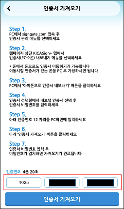

# 14. 보안 HTTP

## **암호화(양방향)**

### 대칭키 암호화 (AES 알고리즘)

`평문 -> 암호화(대칭키) -> 암호문 -> 복호화(대칭키) -> 평문`

- 암호화에 사용한 대칭키를 수신자도 전달받아 그 대칭키로 해독해야함
- 속도가 빠르나, 암/복호화에 사용되는 대칭키를 전달해야하는 문제가 있다.
- AES는 AES-128, AES-192, AES-256등의 종류가 있으며, 숫자가 bit 길이.
- 대칭키 하나로 암/복호화 모두 진행하는 방식으로 문자열 길이에 상관없이 암호화 가능

### 비대칭키 암호화 (RSA 알고리즘, ECC 알고리즘)

`암호화 키 -> 공개키` / `복호화 키 -> 개인 키`

`평문 -> 암호화(공개키) -> 암호문 -> 복호화(개인키) -> 평문`

- 암호화는 공개키, 복호화는 개인키로 두가지 서로 다른 키를 사용
- 보안성은 좋으나 속도가 느리다.
    
    → 대량의 데이터를 암호화하는 데는 적합하지 않음.
    
- 여기서 공개키와 개인키 위치가 바뀌면 전자서명.
- 클라이언트에서 가지고 있는 정보를 서버로 보낼 때, 스니핑 등으로 데이터 노출 방지를 위해 클라이언트에서 가지고 있는 공개키로 데이터를 암호화해서 서버로 전달
- 암호화 가능 길이는 245byte까지라서 긴 문자열 암호화에는 부적합.
    - RSA 암호화에서 널리 사용되는 패딩 스킴인 `PKCS#1 v1.5 패딩`에 의해서 245byte까지 가능하다.
    - `EM (Encoded Message) = 0x00 || 0x02 || PS || 0x00 | | Message`
        - **EM** : 256byte
        - **0x00** : 패딩의 시작을 나타내는 바이트.
        - **0x02** : 패딩 타입을 나타내는 바이트.
        - **PS (패딩 스트링)** : 0x00이 아닌 랜덤 바이트로 채워진 패딩 스트링으로, 길이의 최소값은 8byte
        - **0x00** : 패딩 스트링과 메시지를 구분하는 바이트.
        

### RSA(Rivest-Shamir-Adleman)와 AES(Advanced Encryption Standard)의 조합

- 긴 데이터의 경우 RSA로 전달이 불가능하다. 그래서 다음과 같은 방법으로 진행 가능하다.
    1. 서버에서 한 번만 **공개키 및 개인키를 생성해서 보관**하고 `클라이언트에 공개키를 전달`
    2. 클라이언트에서 서버로 데이터를 보낼 때 AES 대칭키를 생성하고 `대칭키로 데이터를 AES 암호화 진행`
    3. 클라이언트에서 암호화를 진행했던 `대칭키를 서버에서 받았던 공개키를 이용해서 암호화 진행`하고 **데이터와 같이 서버에 전달**.
    4. 서버에서는 `개인키로 AES 대칭키 값을 복호화`하고 `해당 키 값으로 데이터를 복호화`해서 사용.
- 공인인증서 로그인 시에 해당 과정으로 진행.

### 장점

- `RSA`는 **키 교환의 보안을 보장**하고, `AES`는 **데이터 암호화의 성능을 보장**한다.
- AES의 빠른 암/복호화 속도로 인해 대량의 데이터를 효율적으로 처리할 수 있다.

 

## PC에서 인증서를 내보내기 및 모바일 앱에서 가져오기

1. APP에서 인증서 가져오기를 선택한다.
    - APP은 중계서버(KICA)에 인증번호를 요청하여 해당 값을 보여준다.
        
        
        
2. PC에서 내보낼 인증서(개인 키가 포함되어있음)를 선택한 후, 인증서 비밀번호를 입력하여 내보내기를 시도한다.
    
    
    
3. 인증서 비밀번호가 맞다면, APP의 인증번호(중계서버로부터 받은)를 입력한다.
    
    
    
4. PC는 선택한 인증서와 개인 키를 `PKCS#12 형식`으로 내보내서 중계서버로 전송한다. 
    
    
    
    - `PKCS#12 형식`은 인증서와 개인 키를 하나의 파일에 저장하며, 비밀번호(인증서 비밀번호)로 암호화하여 보호한다.
    - 생성된 `PKCS#12 파일`을 `.p12` 또는 `.pfx` 확장자로 저장한다.
5. APP에서 인증서의 비밀번호를 입력한다.
    
    
    
6. APP에서 인증서 데이터 수신한다. →`PKCS#12`값 받기
7. 데이터 복호화를 진행한다.
    - 복호화 후, 성공 / 실패 여부 등 Validation 진행
8. 인증서 데이터를 앱에 저장한다.

 

## PKCS (Public-Key Cryptography Standard)

공개키 기반 구조 (PKI, Public Key Infrastructure)에서 인터넷을 이용해 안전하게 정보를 교환하기 위한 제조사간 비공식 표준 프로토콜로 미국의 RSA가 개발한 암호 작성 시스템.

- PKCS는 애플, 마이크로소프트, DEC 등의 회사에서 공동 개발하였지만, IETF에서 RFC 로 받아들이면서 공식적인 표준으로 인정하고 있다.
- PKCS에서 다루고 있는 Credential은  정보 시스템에서 암호화된 개인정보로 개인의 공개키 암호 알고리즘을 위한 공개키 및 개인키 쌍, 공개키 인증서, CA 관련 정보, 패스워드 등을 포함하는 암호 정보의 총합이다.
    
    
    

### PKCS #5 Password-based Cryptography Specification Version 2.0  (RFC 2898)

- 개인키 정보를 사용자의 패스워드에 기반하여 암호화하는 방법을 정의한 `패스워드 기반 암호 표준`이다.
- 외부에서 개인키를 생성하여 당사자에게 전송시킬 때 개인키를 암호화하는 것을 목적으로 한다.
- 개인키를 특징 기기나 개인이 사용하기 위해 복호화하기 위해서는 패스워드가 필요하다.

### PKCS #12 (Personal Information Exchange Syntax Standard)

- 개인 정보 교환 표준 사용자의 `개인키, 인증서 등의 저장과 교환을 위한 포맷`을 설명한다.
- 개인키와 인증서를 포함할 수 있다.

### 그 외의 PKCS

[https://nexpert.tistory.com/438](https://nexpert.tistory.com/438)