# 15. 엔터티와 인코딩

 

# Content-Encoding / Accept-Encoding

### Brotli (br)

- 구글에서 만든 `Brotli` 압축 알고리즘.
- 주로 웹 서버 및 CDN(Content Deliver Network)에서 **HTTP 콘텐츠를 압축**하여 인터넷 웹 사이트를 더 빠르게 로드하는 데 사용된다.
- `브라우저 캐싱` 및 `정적 리소스 전송`에 최적화
- 압축 속도가 비교적 느리지만, 높은 압축률을 보여준다.
- 브라우저별 지원 버전
    - `Chrome` : 경우 **50(2016/04/20 배포)** 이후 버전
    - `Firefox` **: 44(2016/01/26)** 이후 버전
    - `Safari` : **11(2017/10/05 배포)** 이후 버전
- `css`, `js`, `html` 파일에 대해 `gzip`보다 대략 15~20% 크기 측면에서 효율적인 것으로 알려져 있다.
    - JavaScript 파일 : 약 15%
    - CSS 파일 : 약 16%
    - HTML 파일 : 약 20%
- 참고
    - [https://en.wikipedia.org/wiki/Brotli](https://en.wikipedia.org/wiki/Brotli)

 

### Zstandard (zstd)

- Facebook에서 만든 압축 알고리즘 (오픈소스 제공)
    - [https://facebook.github.io/zstd/](https://facebook.github.io/zstd/)
    - [https://github.com/facebook/zstd](https://github.com/facebook/zstd)
- 주로 속도와 압축 효율성의 균형을 맞추는 데 초점을 맞추고 있다.
- 다양한 사용 사례에 적합
    - 파일 시스템, 데이터베이스, 로그 압축, 파일 압축과 파이프 및 스트리밍 압축
    - 더 일반적인 데이터 압축 솔루션으로 사용
- 브라우저별 지원 버전
    - `Chrome` : 경우 **123(2024/03/19 배포)** 이후 버전
        - iOS Chome 앱은 아직 미제공
    - `Firefox` **: 126(2024/05/14)** 이후 버전
    - `Safari` : **16.4(2023/03/27 배포)** 이후 버전
- 참고
    - [https://chromestatus.com/feature/6186023867908096](https://chromestatus.com/feature/6186023867908096)
    - [https://datatracker.ietf.org/doc/html/rfc8878](https://datatracker.ietf.org/doc/html/rfc8878)

 

## 델타 인코딩

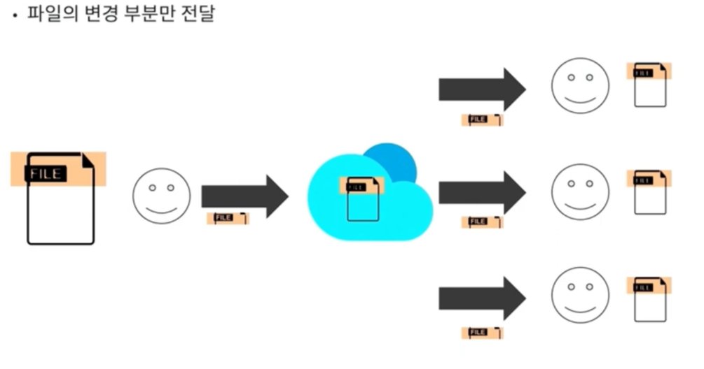

- 완전한 파일이 아닌 **연속 데이터간 데이터 차이의 형태**로 데이터를 저장하고 전송하는 한 방법.
- **두 파일 간의 차이**를 나타내는 델타를 계산하고, 이 델타 정보만을 전송하여 파일을 전송한다.
- **데이터의 중복을 줄이고** **저장 공간을 절약**하거나, **데이터 전송량을 줄이는 데 사용**한다.
- `소프트웨어 배포`, `파일 동기화`, `버전 관리 시스템` 등 다양한 응용 분야에서 사용된다.
    - Git과 같은 버전 관리 시스템
    - 온라인 백업
    - 문서 편집기 (Google Docs)
    - 비디오 / 오디오 코덱

 

### 시그니처 (Signature)

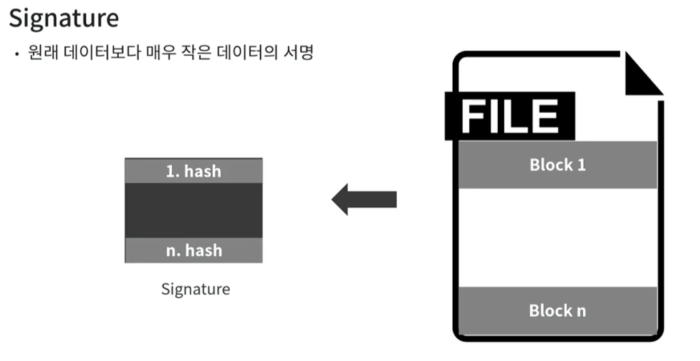

- 원본 파일을 일정한 크기의 블록으로 자르고 각 블록의 체크섬을 계산 후, 계산된 체크섬 블록을 이용하여 비교를 하는데, 이 체크섬 블록을 `Signature`라고 한다.
- 바이트 단위가 아닌 블럭 단위로 비교 수행
- 원본 자체를 비교할 필요 없이, 훨씬 작은 크기의 파일을 가지고 블럭 단위로 비교 가능.
- 구현체마다 스타일이 다르다.
    
    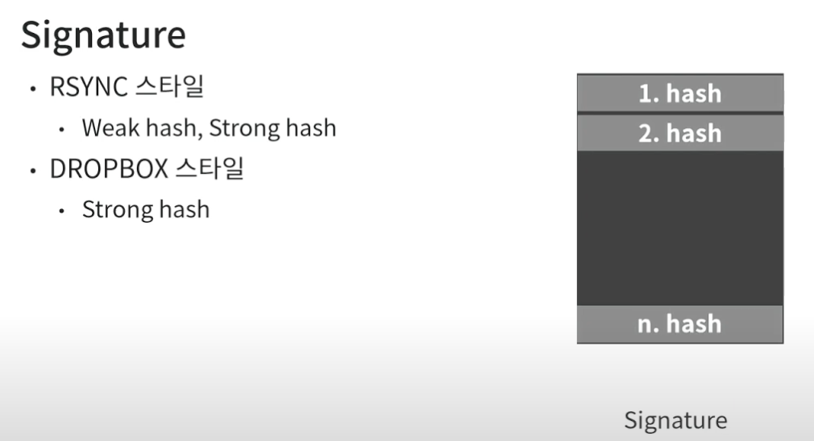
    
    - Weak hash가 Strong hash에 비해 계산 비용이 매우 적고 빠르며, 차지하는 공간도 적다.
    - Weak hash로 1차 비교 후, 같으면 Strong hash로 한번 더 비교.

 

### 시그니처를 이용한 비교 과정

- 파일 A와 B가 동일한 지 확인
    1. 파일 B에서 시그니처 생성 (블럭 크기는 2로 가정)

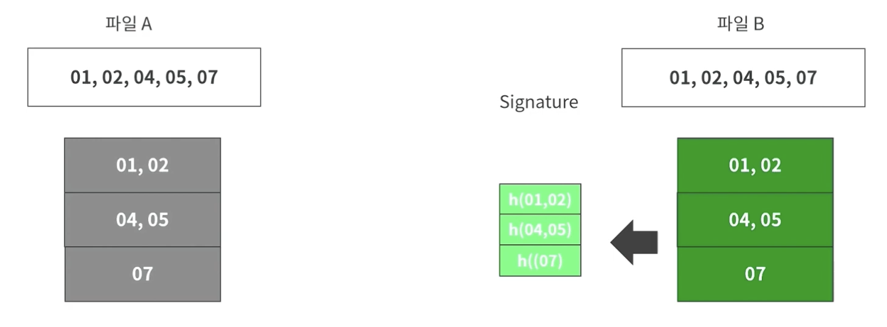

1. 파일 A에서 동일한 블럭 크기로 자르고 해시값을 구한다.
2. 구해진 해시값을 이용해 비교. 해당 부분에서 3회에 걸쳐 동일한 파일인 것을 알 수 있음.

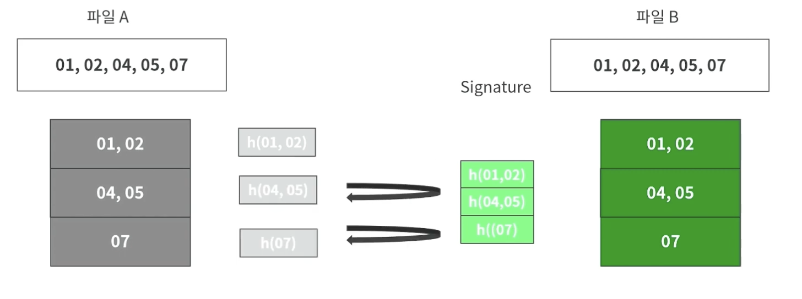

- 파일 A 뒷부분에 데이터(08)가 추가된 경우
    
    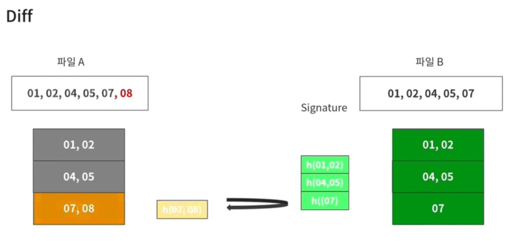
    
    1. 위와 똑같이 블럭을 나누고 해시값을 비교한다.
    2. 1, 2번 블럭은 동일한 것을 확인하였으나, 3번 블럭은 다름을 알 수 있다.

- 파일 A의 처음에 데이터(00)가 추가된 경우
    
    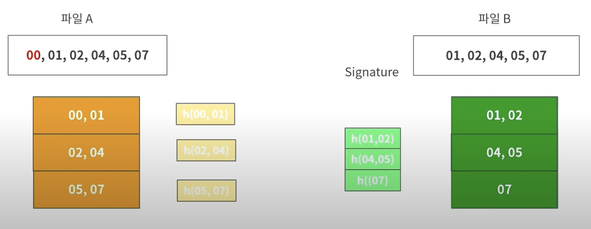
    
    - 블럭으로 비교하면 한 칸씩 뒤로 밀리게 되어 00만 추가되었지만, 모든 구간에서 일치하는 구간을 찾을 수 없다. → 전체가 다르다고 판단.

 

### 롤링 해시 (Rolling Hash)

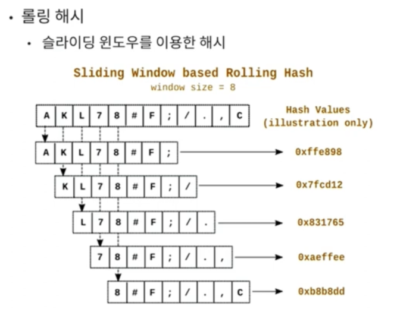

- **롤링 해시**는 입력 데이터를 `슬라이딩 윈도우 방식`으로 처리하여 해시 값을 효율적으로 계산하는 해시 함수다.
- 특정 블록을 한 바이트씩 이동하면서 해시를 계산한다.
- 이전 블록의 해시 값을 바탕으로 새로운 블록의 해시 값을 빠르게 계산할 수 있어, 연속적인 데이터 블록 간의 해시 값을 신속하게 갱신할 수 있다.
- 중복되는 부분의 해시값은 그대로 두고 업데이트되는 부분만 해시값을 계산해주어서 중복되는 연산을 줄일 수 있다

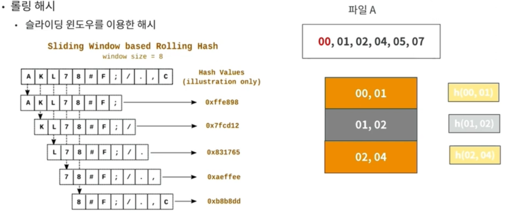

- 이전 예제에서 00이 추가되어 첫 번째 블록이 맞지 않지만, 한번 슬라이드를 한 다음 재계산을 하여 맞는 블럭을 찾을 수 있게된다.
- 슬라이딩을 할 때마다 모든 블록을 다시 재계산 해야하는 오버헤드가 발생 할 수 있다.
    - RSYNC 방식에서는 Weak hash를 이전에 해시값을 `재사용`해서 빠르게 계산할 수 있는 특징이 있다.
    - 첫 번째 블록 계산 후 두 번째 블록으로 이동 시, `K ~ /` 까지 재계산 해야되지만, 슬라이딩 했을 때 빠져나가는 `A`를 제외하고, 추가되는 `/`만 더하는 방식으로 동작한다.
    - 만약 **블럭이 일치하면 한 바이트가 아닌 블럭 단위로 이동**되기에, 더 오버헤드가 줄게된다.
- 조금 더 알아보기
    - [https://blog.naver.com/babobigi/220911965116](https://blog.naver.com/babobigi/220911965116)

 

### Instruction

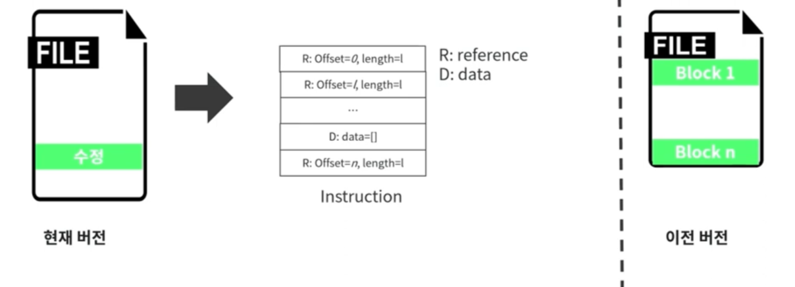

- 위 과정을 모두 소화하면 Instruction이라는 비교 결과를 얻게된다.
- reference와 data로 구성
    - `reference`
        - 실제 전달이 될 필요가 없는 부분.
        - 이전 버전에 포함되어있는 실제 위치를 나타냄. (시작되는 offset과 length값으로 표시)
    - `data`
        - 현재 버전의 실제 변경된 부분 (변경된 데이터 Array가 들어간다.)
- Instruction을 이용한 파일 업데이트 과정
    
    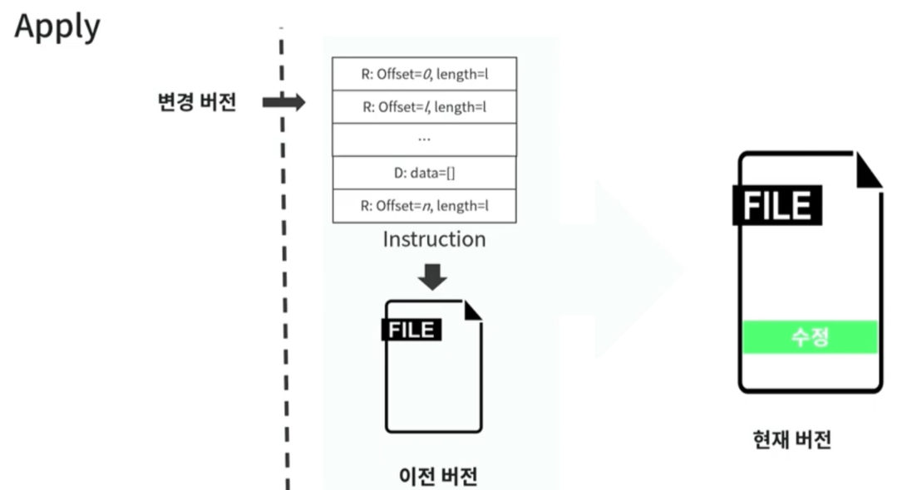
    
    1. 새로운 빈 파일 생성
    2. reference 부분을 만나면, 자신의 파일에서 해당 위치의 데이터를 추가한다.
    3. data 부분을 만나면, 실제 데이터 부분에 포함되어 있는 byte array를 추가한다.
    4. 처음부터 끝까지 Instruction을 실행하게 되면, 이전 버전은 새로운 버전으로 업데이트 된다.

 

### Instruction 생성 과정

1. 시그니처 요청
    
    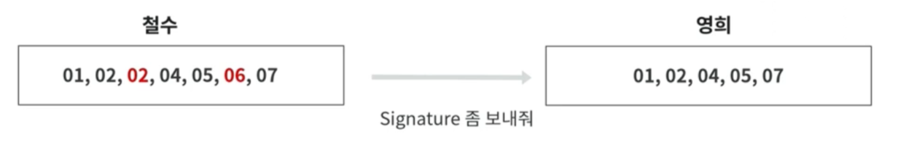
    

1. 시그니처 생성
    - **블록 사이즈**를 `2`로, `weak hash`와 `strong hash`를 계산하여 시그니처 전달.
    
    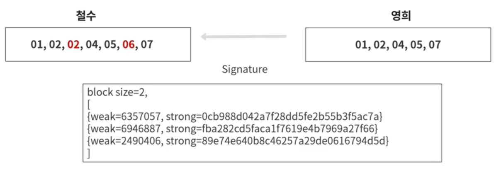
    

1. 전달받은 시그니처의 블록 사이즈와 동일하게 잘라서, 첫 번째 블록부터 비교 진행.
2. 처음 01, 02의 weak hash값을 구한 뒤, 시그니처에서 값이 있는지 확인 → **hit**
    
    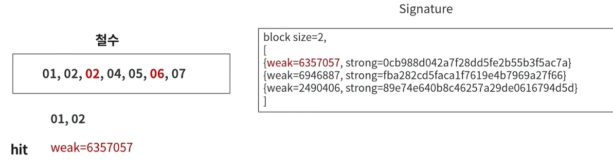
    

1. 실제로 동일한 값인지, strong hash를 구해서 시그니처에서 값이 있는지 확인 → hit
    
    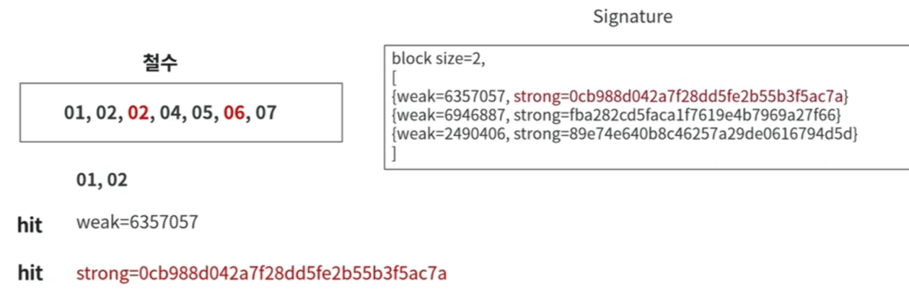
    

1. 첫 번째 블록은 일치하였기에, 한 바이트 이동하지 않고 다음 블록으로 이동하며,
    
    Instruction에는 변경된 부분이 아니기에 reference 타입으로 추가한다.
    
    - 시그니처의 첫 번째에서 찾았기에, offset은 0
    
    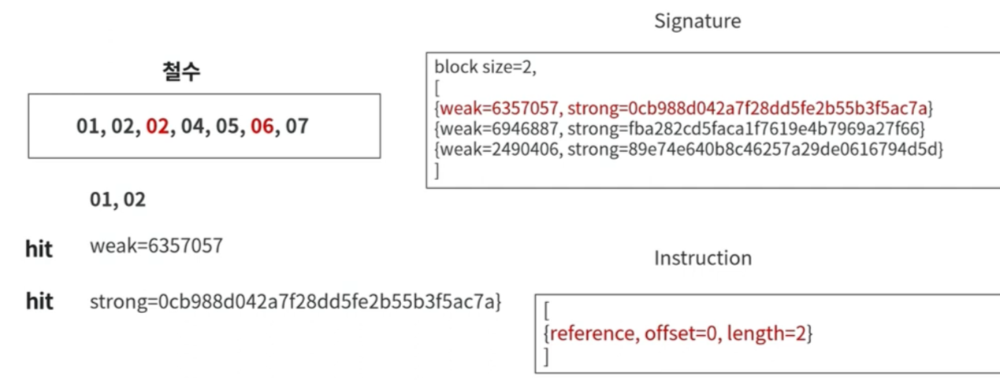
    

1. 다음 블럭 02, 04에 대해서 weak hash를 계산하고 시그니처에서 확인을 해본다. → miss
    
    Instruction에는 롤링을 하는 과정에서 사라지는 02를 데이터에 추가한다.
    
    - 02, 04 에서 롤링이 되어 02가 사라짐.
    
    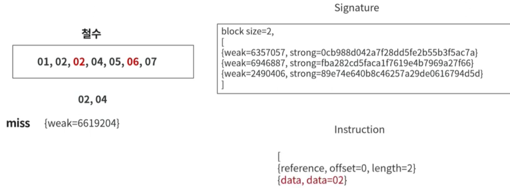
    

1. 다음 바이트로 이동하여 04, 05의 weak hash 계산 후 시그니처에서 확인 및 strong hash 계산 후 시그니처에서 확인 → hit
    
    Instrcution에는 일치하므로 reference 타입으로 추가.
    
    - 시그니처의 2번째에서 찾았기에, offset은 2
    
    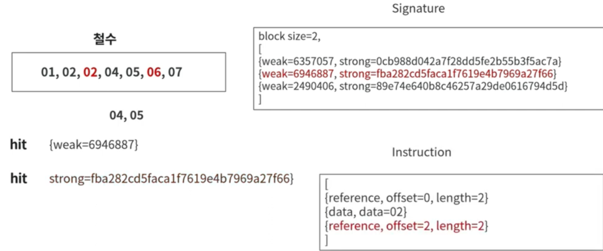
    

1. 다음 블록 06, 07에 대해서 weak hash를 계산하고 시그니처에서 확인을 해본다. → miss
    
    Instruction에는 롤링을 하는 과정에서 사라지는 06를 데이터에 추가한다.
    
    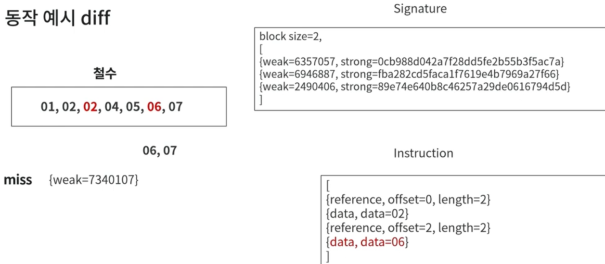
    

1. 마지막 블록으로 이동하고 더 이상 비교할 데이터가 없을 때, 구현체에 따라 동작이 다르다.
    1. 파일 마지막에 도착 시, 다시 한번 해시해서 시그니처에서 확인하는 방법
    2. 나머지 데이터는 data로 추가하는 방법
    
    (아래는 b방식이며, 마지막이 data였어서 그 뒤에 붙여서 추가.)
    
2. 만들어진 Instruction을 전달.

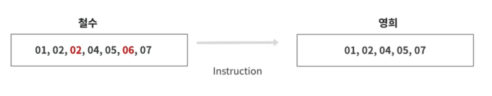

 

### Instruction 적용 과정 (파일 재구성)

1. 빈 파일 생성
2. 첫 번째 Instruction을 해석. reference 블록이기 때문에, 본인이 가지고 있는 파일에서 offset 0번에서 2만큼의 데이터를 새로운 파일에 기록 
    
    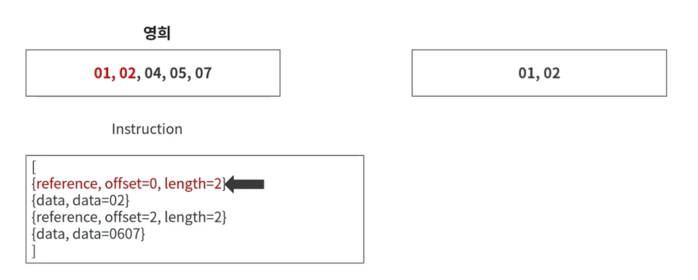
    

1. 두 번째 Instruction은 data 블록이기 때문에, 데이터값 그대로를 파일에 추가한다.
    
    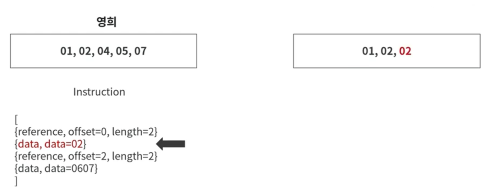
    

1. 세 번째 Instruction인 reference 타입을 확인하고, 자신의 파일에서 offset 2에서 2만큼을 파일에 추가한다.
    
    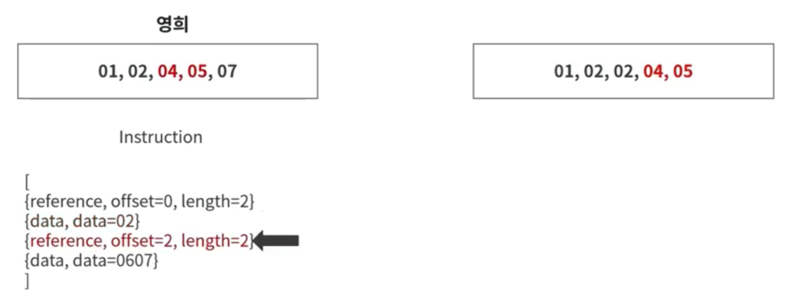
    

1. 네 번째 Instruction. 데이터 블록에서 데이터값 그대로를 파일에 추가한다.
    
    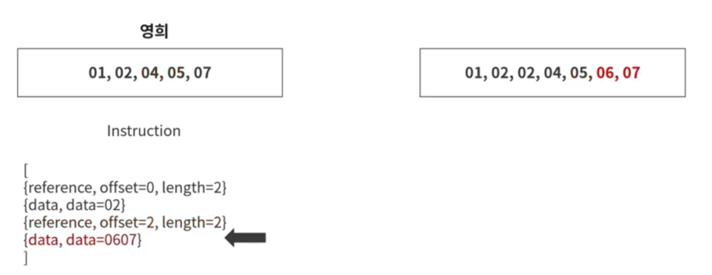
    

1. 업데이트 완료
    
    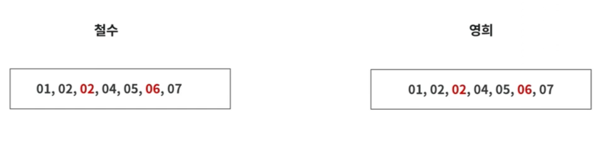
    

 

### 클라이언트 ↔ 서버의 업/다운로드에서의 동작 및 델타 인코딩 적용 시 성능 이슈, Trade off에 대한 영상

- [https://www.youtube.com/watch?v=iDsIccISD8o](https://www.youtube.com/watch?v=iDsIccISD8o)