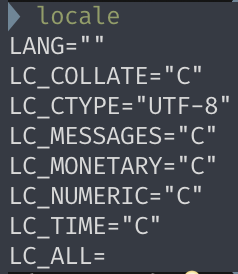
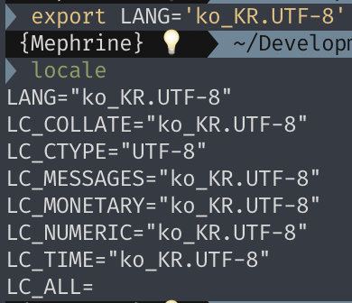
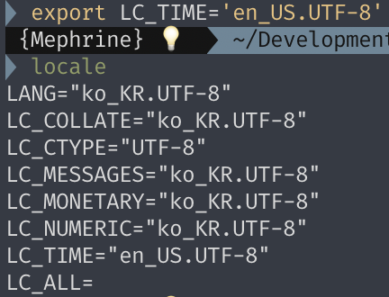
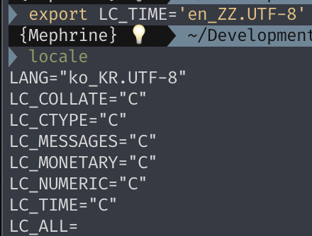

# 16. 국제화

## Locale

Locale은 사용자 인터페이스에서 사용되는 `언어`, `지역 설정`, `출력 형식` 등을 정의하는 문자열이다.

- POSIX 기반의 시스템에서는 같은 형식을 공유
    - Unix, Linux와 같은 POSIX 기반의 시스템 외에 MacOS를 비롯한 Darwin 계열 운영체제들도 POSIX 호환이 되기에 동일한 형식을 사용.
- 메시지, 시간 형식, 통화 형식 등의 출력이나 동작을 변경할 수 있다.
    - 특정 언어의 입출력에 영향을 주는 경우가 있어서, 영어 이외의 언어를 사용하는 경우 적절한 값을 지정해야한다.


<br>

### 형식

- `일반적`으로 다음과 같은 형식을 따른다.
    
    ```
    language[_territory][.codeset][@modifier]
    ```
    


- `ko`는 한국어(한글)을 의미하며, ISO 639-1 표준 형식을 따른다.
- `KR` 값은 지역을 의미하며, ISO 3166-1 표준 형식을 따른다.
- `UTF-8`은 EUC-KR 같은 문자 인코딩 코드셋을 지정해준다.
- 추가적인 예
    - `en_US.UTF-8`: 영어, 미국, UTF-8 인코딩
    - `en_CA.UTF-8`: 영어, 캐나다, UTF-8 인코딩
    - `en_GB.UTF-8`: 영어, 영국, UTF-8 인코딩
    - `en_HK.UTF-8`: 영어, 홍콩, UTF-8 인코딩

<br>

### C Locale



- POSIX 준수 시스템에 대한 기본 시스템 Locale
- Locale 환경 변수의 설정을 해제하면 C Locale로 표기된다.
- `C`는 표준에 있는 Locale Name이며, C언어 표준 중 `7.11.1.1 The setlocale function` 에 `A value of "C" for locale specifies the minimal environment for C translation;` 라고 명시되었기 때문이다.
    - [https://superuser.com/a/219953](https://superuser.com/a/219953)
- Locale 설정값
    - **LANG :** 전역 Locale 설정값. 다른 값이 설정되어있지 않을 때만 적용되며, 우선순위가 가장 낮음.
    - **LC_COLLATE :** 문자열의 정렬 순서를 결정하는 Locale을 지정.
    - **LC_CTYPE :** 문자 분류, 글자수, 대소문자 구분이 되는 Locale을 지정.
    - **LC_MESSAGES :** 메시지를 표시하는 기준이 되는 Locale을 지정.
    - **LC_MONETARY :** 통화나 금액과 관련된 숫자의 기준이 되는 Locale을 지정.
    - **LC_NUMERIC :** 숫자와 관련된 기준이 되는 Locale을 지정.
    - **LC_TIME :** 날짜, 시간과 관련된 Locale을 지정.
    - **LC_ALL :** 전역 Locale 설정값. 우선순위가 가장 높다.

<br>

### 환경변수 변경

- export 명령어 사용
    
    ```bash
    export 설정값=Locale
    
    # LANG을 `ko_KR.UTF-8`로 설정
    export LANG='ko_KR.UTF-8'
    ```
    
    - ko_KR.UTF-8
        
        
        
    - en_US.UTF-8
        
        
        
    - 잘못된 값 입력
        
        
        
- Locale별 Date
    | Locale | Date |
    | --- | --- |
    | C | Mon Jun 10 22:09:30 KST 2024 |
    | ko_KR.UTF8 | 2024년 6월 10일 월요일 22시 17분 18초 KST |
    | en_US.UTF-8 | Mon Jun 10 22:19:45 KST 2024 |
    | en_GB.UTF-8 | Mon 10 Jun 2024 22:21:24 KST |
    | zh_CN.UTF-8 | 2024年 6月10日 星期一 22时22分36秒 KST |