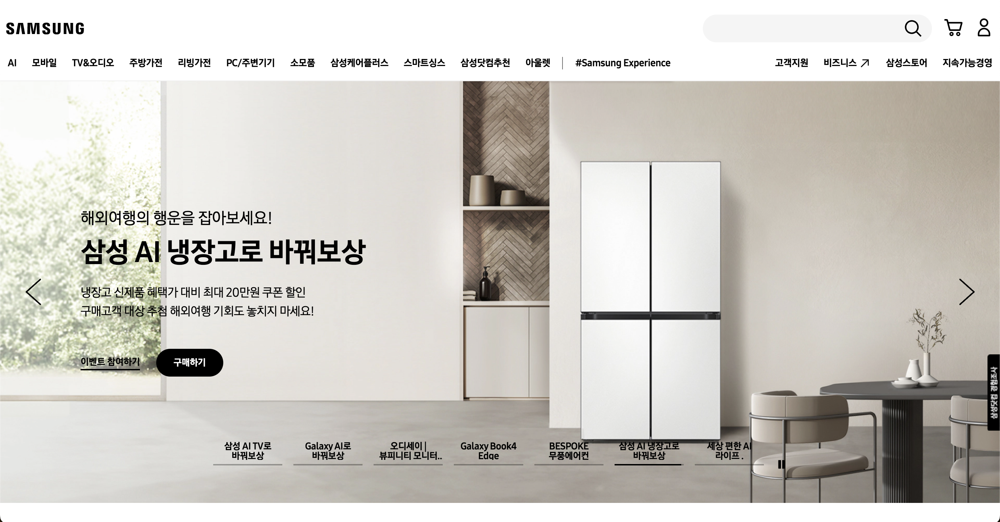
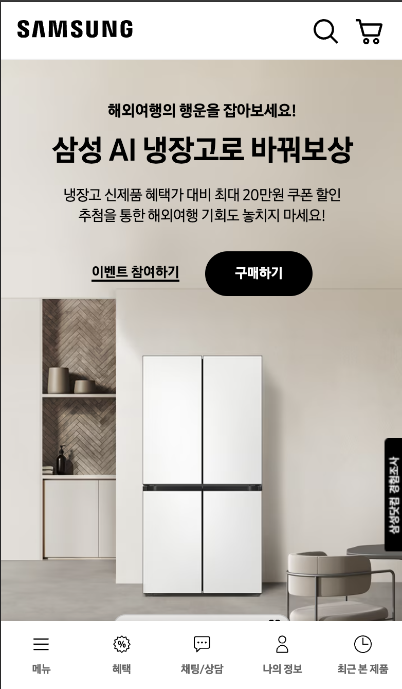
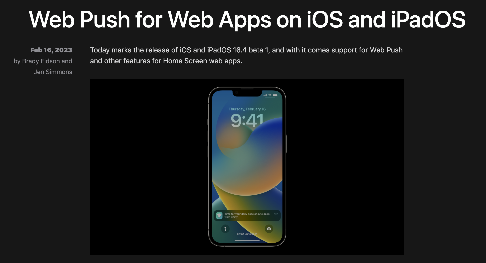

# 17. 내용 협상과 트랜스코딩

## Responsive Web Design (RWD)

- 여러 장치의 다양한 특성에 대응하는 하나의 웹 문서 또는 사이트로써 브라우저의 크기(스크린의 크기, 디바이스의 종류)에 실시간으로 반응하여 크기에 따라 레이아웃이 변하는 웹 사이트
    - 예) [https://www.samsung.com/sec/](https://www.samsung.com/sec/)
- `미디어 쿼리(media queries)`를 활용하여 화면 크기에 따라 레이아웃, 이미지 크기, 텍스트 크기 등을 동적으로 변경 (CSS2.1부터 가능은 했으나, CSS3부터 많이 개선되어 도입)
- 장점
    - 하나의 콘텐츠에 오직 하나의 HTML 소스만 있기 때문에 하나의 소스를 수정하면 모든 스크린 사이즈에 맞춰 컨텐츠가 최적화되기 때문에 `유지보수가 효율적`이다.
    - PC용 URL과 모바일용 URL이 동일하여 `SEO 최적화에 유리`하다.
- 단점
    - 읽어 들여야 할 소스가 많아 불필요하게 많은 데이터를 소비하기 때문에, `사이트의 속도`가 **적응형에 비해 상대적으로 무겁다**.
    - 웹 브라우저는 스펙 및 사양이 제각기 다르기 때문에 `웹브라우저 호환성 문제`가 발생할 수 있다.

## Server-Side Rendering (SSR)과 Client-Side Rendering (CSR)

### MPA vs SPA (페이지 구성 방식 비교)

**SPA**

- `하나의 페이지`로 구성된 웹 애플리케이션.
- 전체가 아닌 `일부만 갱신`이 되어 화면 깜빡임이 없다.
    - 필요한 부분만 클라이언트가 동적으로 갈아끼울 수 있음. (AJAX)
- React, Angular, Vue와 같은 자바스크립트 기반 프레임워크를 사용해 SPA를 개발
- 필요한 정적 리소스를 한꺼번에 모두 다운로드하고, 이후 새로운 페이지 요청이 왔을 때 필요한 데이터만 전달받아서 클라이언트에서 필요한 페이지를 갱신하기 때문에 `일반적으로 CSR로 렌더링`한다.

**MPA**

- 일부를 갱신할 때에도, 서버로부터 새로운 HTML을 새로 받아와서 `페이지 전체를 렌더링`하여 화면 깜빡임이 있다. (전통적인 웹 페이지 구성 방식)
    - 탭 전환 시, URL이 변환되며 새로운 페이지를 불러옴.
- PHP, JSP를 사용해 MPA를 개발
- 새로운 요청이 있을 때마다 서버에서 이미 렌더링 된 정적 리소스를 받아오기 때문에 `일반적으로 SSR로 렌더링`한다.

### 단, 이러한 특징 때문에 SPA === CSR, MPA === SSR이라는 오해가 생기긴 하나, 이 두 개념은 페이지의 개수와 렌더링을 어디서 하는지 등에 따라 다른 개념이다.

 

## SSR

초기 페이지 로드를 서버에서 처리하고, 완전히 렌더링된 HTML을 클라이언트에 전송하는 방식.

- 동작과정
    
    
    
    1. 유저가 웹사이트에 방문하면, 브라우저가 서버에 콘텐츠를 요청한다.
    2. 서버는 페이지에 필요한 데이터를 즉시 얻어와 모두 삽입하고, CSS까지 모두 적용해 렌더링 준비를 마친 HTML과 JavaScript코드를 브라우저에 응답으로 전달한다.
    3. 브라우저에서는 JavaScript코드를 다운로드하고 HTML에 JavaScript로직을 연결한다.
- 장점
    - **초기 로딩 속도**가 빠르다.
    - **SEO 최적화**가 용이하다.
        - 모든 데이터가 이미 HTML에 담긴 채로 브라우저에 전달되기 때문
    - 서버에서 렌더링을 처리하므로, **저사양 기기에서도 성능이 향상**된다.
- 단점
    - **서버 부하가 증가**할 수 있으며, 서버-클라이언트 간 **네트워크 지연이 발생할 수 있다**.
    - 서버와 클라이언트 모두에서 렌더링 로직을 관리해야 하는 `복잡성`이 있다.
    - `TTV(Time to View)`와 `TTI(Time to Interact)` 간의 시간 간격이 존재
        - 서버로부터 전달받은 HTML은 내용과 스타일이 입혀진 껍데기에 불과하다. 실제로는 클라이언트 측 JavaScript가 실행되고 이벤트 핸들러가 첨부된 JavaScript 로직이 모두 연결될 때까지 사용자의 입력에 응답할 수 없다.

### SSG (Static Site Generation)

- `Static Rendering` 이라고도 불리는 방식
- 서버에서 HTML을 보내준다는 차원에서는 SSR과 유사하나, `언제` 만들어주는지에 따른 시점 차이가 있다.
    - `SSR` → **요청 시 서버에서 즉시 HTML을 만들어 응답**하기에 데이터가 달라지거나 자주 바뀌어서 미리 만들어 두기 어려운 페이지에 적합하다.
    - `SSG` → **페이지들을 서버에 모두 만들어 둔 뒤**에, 요청 시 해당 페이지를 응답하는 것이므로 바뀔 일이 거의 없어서 캐싱해 두면 좋은 페이지에 사용하면 적합하다.

 

## CSR

초기 페이지 로드를 클라이언트(브라우저)에서 처리하고, 자바스크립트를 통해 동적으로 콘텐츠를 생성하고 렌더링하는 방식.

- 동작과정
    
    
    
    1. 유저가 웹사이트에 방문하면, 브라우저가 서버에 콘텐츠를 요청한다.
    2. 서버는 빈 뼈대만 있는 HTML을 응답으로 보내준다.
    3. 브라우저가 연결된 JavaScript 링크를 통해 서버로부터 다시 JavaScript 파일을 다운로드한다.
    4. JavaScript를 통해 동적으로 페이지를 만들어 브라우저에 띄워준다.
- 장점
    - 초기 로딩 이후에 페이지 일부를 변경할 시, `구동 속도 빠르다`.
    - 빈 뼈대만 있는 HTML을 넘겨주는 역할만 수행하면 되기에 `서버 부하가 감소하며` , 네트워크 트래픽이 줄어든다.
    - 클라이언트 측에서 연산, 라우팅 등을 모두 직접 처리하기 때문에 `반응속도가 빠르다`.
    - JavaScript가 동적으로 DOM을 생성하기 때문에, HTML은 JavaScript 로직이 모두 완전히 연결된 상태라 **사용자가 보는 시점과 이용할 수 있는 시점이 동일**하다.
- 단점
    - `초기 로딩 시간이 길어질 수 있으며`, 저사양 기기에서 성능 문제가 발생할 수 있다.
    - **SEO 최적화**가 어려울 수 있다.
        - 웹 크롤러 봇 입장에서는 HTML이 텅텅 비어 있는 것처럼 보여서 색인할만한 콘텐츠가 존재하지 않기 때문. (자바스크립트를 실행할 줄 아는 CSR 웹 크롤링도 존재)
- 단점 보완법
    - code splitting / tree-shaking / chunk 분리 : JS 번들 크기를 줄여서 초기 DOM 생성 속도를 줄여 초기 `로딩 속도를 보완`할 수 있다.
    - pre-rendering : 각 페이지에 대한 HTML 파일을 미리 생성해둔 뒤, 서버에게 요청하는 자가 만약 크롤러라면 HTML 버전 페이지를 보여주어 `SEO를 보완`할 수 있다.
    - SSR, SSG 도입 → CSR의 단점들 보완

### 서비스 성격에 따른 적절한 렌더링  방식

 **CSR**

- 유저와 상호작용이 많다
- 대부분이 고객의 개인정보로 이루어진 페이지들이라 검색엔진에 노출될 필요는 없다

**SSR**

- 회사 홈페이지 등으로 홍보나 상위노출이 필요하다
- 누구에게나 항상 같은 내용을 보여준다
- 업데이트가 빈번해 해당 페이지 데이터가 자주 바뀐다

**SSG**

- 회사 홈페이지 등으로 홍보나 상위노출이 필요하다
- 누구에게나 항상 같은 내용을 보여준다
- 업데이트를 거의 하지 않는다

**Universal Rendering (초기 렌더링으로는 SSR + 이후 CSR)**

- 사용자에 따라 페이지 내용이 달라진다
- 빠른 interaction과 화면 깜빡임이 없어야 한다
- SEO를 포기할 수 없어 상위노출이 되어야 한다

 

## Progressive Web Apps (PWA)

웹 애플리케이션을 네이티브 앱처럼 동작하도록 하여, 오프라인 접근, 푸시 알림, 홈 화면 아이콘 등의 기능을 제공한다.

- **장점**
    - `빠른 성능`을 제공한다.
    - 앱 스토어를 거치지 않아도 웹 브라우저에서 바로 앱을 사용할 수 있다.
    - 오프라인에서도 접근 가능하며 (캐싱 이용), 푸시 알림 등 `고급 기능을 제공`한다.
    - `검색 엔진 최적화(SEO)에 유리`하다.
    - 네이티브 앱과 유사한 사용자 경험을 제공하면서도 `배포가 용이`하다.
- **단점**
    - 아직 모든 기능이 네이티브 앱과 같지는 않다.
        - OS에서 지원하지 않는 경우 하드웨어 접근이나 네이티브 기능에 대한 제한이 있을 수 있다. 따라서 사용자 경험이 모든 디바이스에서 동일하지 않을 수 있다.
    - 브라우저에서 실행되기 때문에 네이티브 앱에 비해서 **지연 속도가 크고 배터리 소모량이 더 많을 수 있다**.
    - **모든 브라우저에서 동일하게 지원되지 않을 수 있으며**, **초기 설정과 구현이 복잡**할 수 있다.