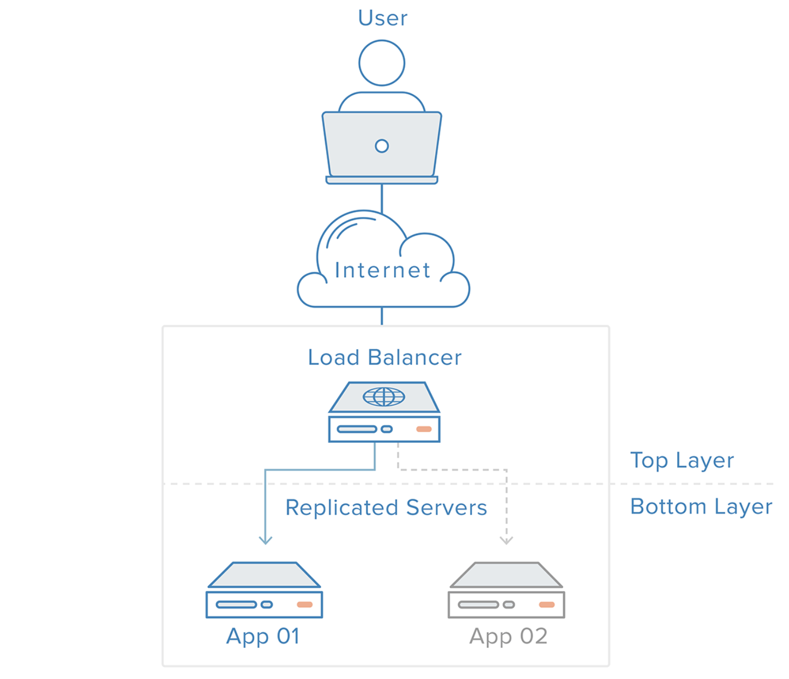
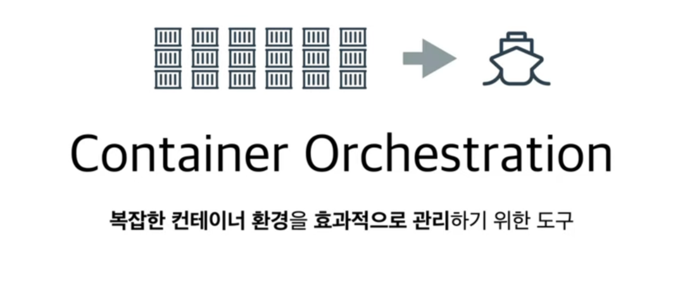
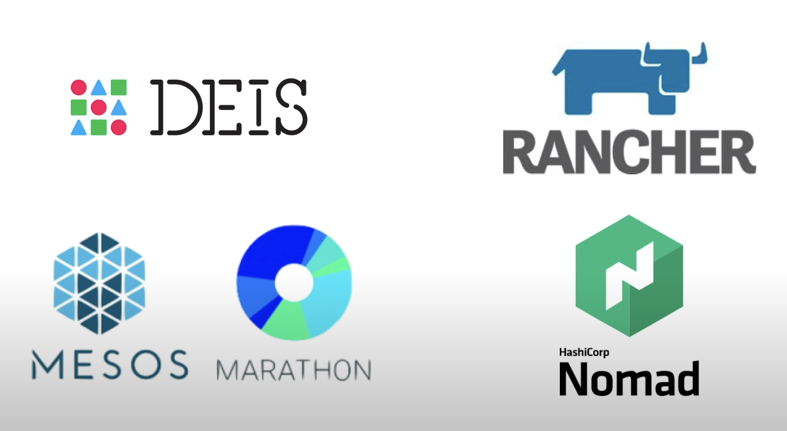
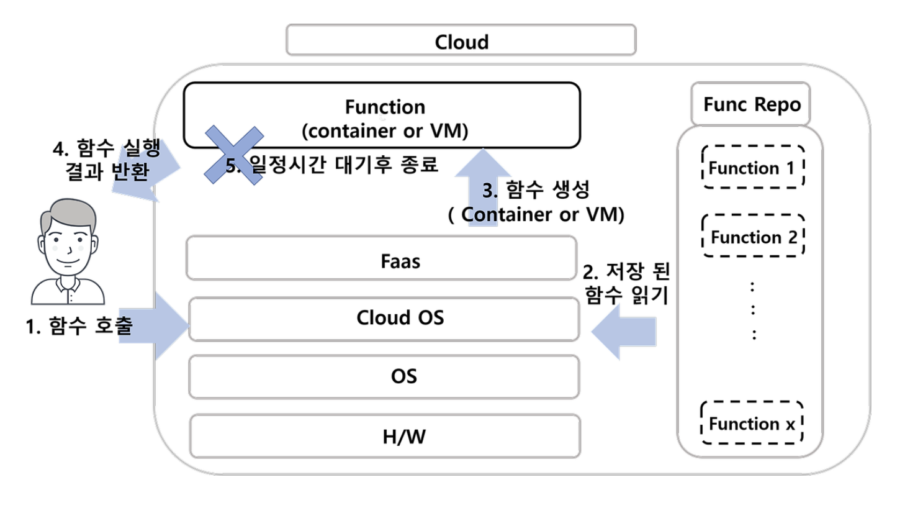

# 18. 웹 호스팅

## 1. 로드 밸런싱 (Load Balancing)

- **여러 서버에 트래픽을 분산**시켜 각 서버의 부하를 줄이고 서비스의 안정성을 높이는 기법으로, 부하를 분산해주는 장치 또는 기술을 통칭한다.
- `로드 밸런서`는 **트래픽을 각 서버로 효율적으로 분배**하여 특정 서버에 과부하가 걸리지 않도록 한다.
- 클라우드 기반 로드 밸런싱 서비스가 널리 사용된다.
    - AWS Elastic Load Balancing(ELB), Google Cloud Load Balancing 등

 

## 2. 자동 스케일링 (Auto Scaling)

- 모니터링 결과나 사용자 설정에 따라서 가상 서버 수를 늘리거나 줄여 수요 변화에 탄력적으로 대응할 수 있도록 돕는 서비스
- 클라우드 인프라에서 주로 사용되며, 사용량에 따라 자원을 동적으로 조절하여 비용 효율성을 높인다.
    - 클라우드 환경은 공간의 제약이나 하드웨어적인 제약이 없으며, 성능과 비용이 비례하다는 특징이 있다.
    - Scale Out을 자동화하기 위해 나온 서비스다.
- AWS Auto Scaling, Google Cloud Autoscaler, Azure Autoscale 등의 클라우드 서비스가 많이 사용된다.

 

## 3. 데이터베이스 리플리케이션 (Database Replication)

- 여러 개의 DB를 권한에 따라 수직적인 구조(Master-Slave)로 구축하는 방식
    - `Master Node`는 **쓰기 작업만**을 처리하며 `Slave Node`는 **읽기 작업만**을 처리
- 데이터를 **여러 데이터베이스 서버에 복제**하여 데이터의 `가용성`과 `안정성`을 높이는 방법.
- 데이터 손실을 방지하고, 읽기 성능을 향상시킬 수 있다.
    - Query의 대부분을 차지하는 `Select`를 어느 정도 해결하기 위해 Replication이란 방법이 나오게 되었음.
- 클라우드 기반 DB 서비스(AWS RDS, Google Cloud SQL 등)에서 리플리케이션 기능을 제공한다.
    
    
    

 

## 4. 컨테이너 오케스트레이션 (Container Orchestration)

- 컨테이너화된 애플리케이션의 배포, 관리, 확장 및 네트워킹을 자동화하는 방법.
    - **컨테이너의 생성과 소멸, 자동 배치 및 복제, 장애 복구, 스케줄링, 로드 밸런싱, 클러스터링 등 컨테이너로 애플리케이션을 구성하는 모든 과정을 관리**할 수 있다.
- 구글에서 개발하고 CNCF(Cloud Native Computing Foundation)에 기증된 `Kubernetes`와 같은 오케스트레이션 도구를 사용하여 대규모 애플리케이션을 효율적으로 관리할 수 있다.
- k8s가 사실상의 표준으로 자리잡았으며 AWS EKS, GCP GKE, Azure AKS 및 IBM Cloud 등 주요 클라우드 서비스 제공업체에서 k8s 서비스를 제공한다.
- 그 외 Docker Swarm, Apache Mesos, HashiCorp Nomad, AWS ECS(Elastic Container Service) 등의 컨테이너 오케스트레이션이 존재.
    
    
    

 

## 5. 서버리스 컴퓨팅 (Serverless Computing)

- `서드 파티 관리 서버 인프라`에서 애플리케이션을 구축하고 배포할 수 있는 애플리케이션 개발 모델
- **서버 공간과 인프라 문제는 모두 업체가 처리**하여, `개발자`가 서버 인프라를 관리하지 않고 **코드 실행에 집중**할 수 있게 해주는 클라우드 컴퓨팅 모델
    - 사용자는 스케일링, 업데이트, 보안 등 런타임 관리와 운영에 대해 시간을 소모하지 않고 핵심 제품에 집중할 수 있다
- `클라우드 On-demand`와는 달리, **필요한 컴퓨팅 리소스와 스토리지만 동적으로 할당한 다음 그 부분에 대해서만 비용을 청구**한다.
    - On-demand는 사용자들이 서버를 사용하지 않더라도 그냥 `가동만 시켜도 시간마다 결제`.
    - 서버리스에 업로드한 함수는 24시간 내내 돌아가는게 아닌 휴면 상태에서, 요청이 오는 순간 서버리스는 잠들어 있는 함수를 깨우고 실행시켜 요청한 작업을 수행하여, `수행한 함수만큼만 결제`

### FaaS(Function-as-a-Service) 모델

- 개발자는 사용자 정의 서버 측 로직을 작성하지만, 클라우드 서비스 제공업체가 관리를 전담하는 서버 컨테이너에서 실행되는 서비스 기능.
- 서버에서 수행될 기능들을 **개발자가 직접 코드로 작성하여 등록**한다.
- `Event-Driven 아키텍처`를 구현하는데 적합하며, **사용자가 원하는 기능(함수)을 미리 작성**해놓고 **특정 이벤트(예를 들어 HTTP Request, API 호출, 특정 조건 등)가 발생하면 알아서 호출 및 종료**된다.
    - 서버는 계속 대기하면서 이벤트를 기다리지 않고, **이벤트가 발생할 때마다 실행한다.**
- **호출한 함수의 횟수와 실행 시간**에 따라 `비용을 지불`한다.
- AWS Lambda, Google Cloud Functions, Azure Functions, Cloudflare Workers

### BaaS(Backend-as-a-Service) 모델

- 서비스 개발에 있어서 필요한 다양한 기능들 (데이터베이스, 소셜서비스 연동, 파일시스템 등)을 개발자가 직접 개발하지 않고, **클라우드 공급자가 제공하는 서비스를 이용해 쉽고 안정적으로 구현** 하는 것
    - 서버 개발을 하지 않고서도 필요한 기능을 `쉽고 빠르게 구현`할 수 있게된다.
    - 개발 시간이 단축되며, `서버 확장 작업이 불필요`하다.
    - 서비스 제공자로부터 미리 만들어진 백엔드 API를 제공받아 사용하는 형태.
- **API 사용량 및 서버 사용 시간**에 따라 `비용을 지불`한다.
- Firebase