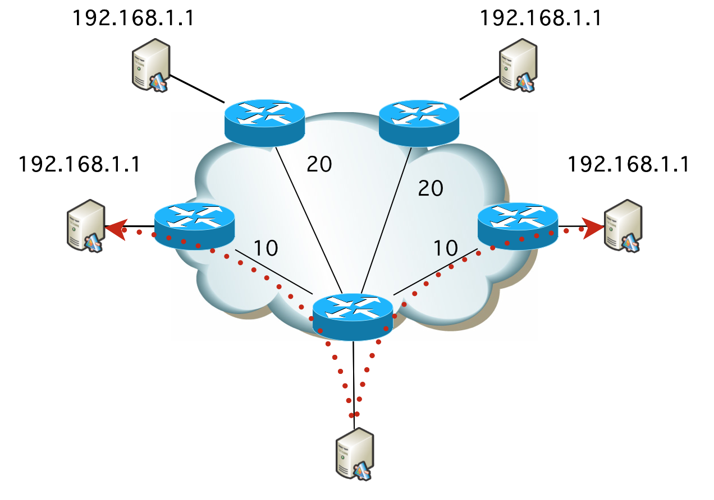

# 20. 리다이렉션과 부하 균형

## 임의 캐스트 어드레싱(Anycast Addressing)

- Anycast는 네트워크 라우팅 방식 중 하나로, 동일한 IP 주소를 여러 지점에 할당하여 **최적의 지점(가장 가까운 또는 가장 적합한 지점)으로 트래픽을 라우팅하는 기술**이다.
    
    ### 네트워크 라우팅 방식
    
    | 타입 | 통신 대상 | 범위 | IPv4 | IPv6 | 사용 사례 | TCP, UDP 지원 여부 |
    | --- | --- | --- | --- | --- | --- | --- |
    | 유니캐스트 | 1 : 1 | 전체 네트워크 | O | O | HTTP | TCP, UDP 모두 지원 |
    | 브로드캐스트 | 1 : ALL | 서브넷 (로컬 네트워크) | O | X | ARP | UDP 지원 |
    | 멀티캐스트 | 1 : GROUP | 정의된 구간 | O | O | 방송 | UDP 지원 |
    | 애니캐스트 | 1 : 1 | 전체 네트워크 | △ | O | 6 to 4 DNS | UDP 지원 |
- 특정 서비스에 대한 요청이 지리적으로 가장 가까운 서버 또는 노드로 전달되어 **응답 시간을 단축**하고 **네트워크 부하를 분산**시킬 수 있다.
- 선택적 라우팅을 통해 Anycast 네트워크는 `높은 트래픽 볼륨`, `네트워크 정체`, `DDos 공격`에 대해 탄력적으로 대처할 수 있다.

 

### 사용 사례

- **DNS 서비스**
    
    
    
    - DNS 루트 서버는 Anycast를 사용하여 **전 세계 여러 위치에서 동일한 IP 주소로 접근**할 수 있도록 한다. 이로인해, DNS 요청이 가장 가까운 서버로 라우팅되어 `빠른 응답을 제공`할 수 있다.
    - e.g.) Google Public DNS (8.8.8.8), Clodeflare (1.1.1.1)
- **콘텐츠 배포 네트워크(CDN)**
    - CDN은 Anycast를 사용하여 **웹 콘텐츠를 여러 캐시 서버에 저장**하고, **사용자 요청이 가장 가까운 캐시 서버로 전달**되도록 하여, `콘텐츠 전달 속도를 크게 향상`시킨다.
    - 일반적으로 요청을 효율적으로 처리할 수 있는 **가장 가까운 데이터 센터**로 들어오는 트래픽을 라우팅한다.
    - e.g.) Cloudflare, Akamai
- **DDoS 방어**
    
    
    
    - CDN이 Unicast 주소를 사용하는 경우, 트래픽은 특정 노드로 직접 라우팅되어 네트워크가 DDoS 공격과 같은 비정상적인 트래픽을 경험할 때 취약점이 발생한다.
        
        → 해당 위치 또는 주변 인프라가 트래픽으로 인해 압도되어 **합법적인 요청에 대한 서비스 거부가 발생할 가능성**이 있다.
        
    - 다른 DDoS 완화 도구가 일부 공격 트래픽을 필터링한 후, Anycast는 나머지 **공격 트래픽을 여러 데이터 센터에 분산**하여 한 위치에서 요청으로 압도되는 것을 방지한다.
        - Anycast 네트워크의 용량이 공격 트래픽보다 크면 공격이 효과적으로 완화한다.

 

### **Anycast의 장점**

- L4 / L7 같은 로드 밸런싱 장비가 필요없다.
    - 글로벌 PoP에 서버 가용성 및 성능 로드 밸런싱을 위해서 비싼 L4 / L7장비를 내보내지 않아도 된다. 라우터 + 서버로만 동작.
    - PoP(Point of Presence) : 인터넷 망에 대한 접속점 또는 ISP 망 상호 간의 접속점
- 사용자와 가장 가까운 지역으로 안내한다.
- L4 / L7 에서 인바운드 대규모 트래픽이 들어오면 장비에서 입력 트래픽 자체가 버티기 힘들지만, 서버로 직접 들어오기 때문에 **서버를 분산하여 입력 대규모 트래픽을 처리**하는 용도로 사용 할 수 있다.
- 장애 시, 다른 Anycast 지역으로 자동 우회한다. 이에 따라 회선을 이중화 하지 않아도 되며 속도 측면에서 다른 Anycast 지역으로 우회하기 때문에 복구될 때 까지 차선의 지역으로 인해 **약간 느려질 수 있으나 회선 이중화 비용을 절감**할 수 있다.

### **Anycast의 단점**

- 네트워크 적으로 가까운 곳을 택하기 때문에 지리적인 지역성을 따르지 않을 수도 있다.
    - e.g.) 가까운 싱가폴 인접지역 사용자가 싱가폴 PoP으로 들어오면 좋지만 네트워크적으로 미국이 가까워 미국으로 가는 경우가 있다. 이것은 ISP 마다 라우팅 정책이 있으므로 컨트롤이 어렵다.
    - e.g.) Google public DNS 홍콩 PoP지역의 경우, Physical IP 정보는 미국이지만 실제 서버는 홍콩에 있기 때문에 홍콩에서 매우 가깝게 응답된다.
- 라우터라서 서버의 어플리케이션의 헬스체크가 안 되어, 이상동작 여부를 판단 할 수 없다.
    - 자체 모니터링 툴을 이용해서 어플리케이션 장애 시, 서버의 BGP 데몬을 직접 컨트롤하여 서비스 제외하는 방법 등이 있다.

 

## Autonomous System (AS)

- **하나의 관리 집합 내의 라우터들의 집합**
    - 고유한 라우팅 정책을 가지고 있는 ISP(Internet Service Provider, sk브로드밴드, LG U+, kt 등), 정부(공공)기관, 회사, 단체 등 집합 내의 라우터들의 집합
- **동일한 라우팅 프로토콜을 사용해 정보를 교환**하는 라우터들의 그룹으로 구성되어 있다.
- 단일 관리 도메인 하에 운영되는 IP 네트워크 또는 네트워크 그룹을 의미하며, 네트워크의 내/외부로 데이터 트래픽을 라우팅하는 논리적 집합이다.

### **inter-AS / intra-AS**

 - **intra-AS :** 경우 하나의 AS 내의 라우터 끼리 관계를 의미한다.
    - IGP / IRP 프로토콜이 사용된다.
        - IGP종류 : RIP, IGRP, EIGRP, OSPF
- **inter-AS :** AS와 AS간의 관계를 의미한다.
    - EGP / ERP 프로토콜이 사용된다.
        - EGP 종류: BGP

 

## Border Gateway Protocol (BGP)

AS의 가장자리에 위치한 BG(Border Gateway)들 간의 프로토콜을 말한다.

- 인터넷의 백본을 형성하는 프로토콜로, 전 세계 AS들이 서로 라우팅 정보를 교환하여 인터넷 트래픽을 최적의 경로로 전달할 수 있도록 한다.
- `다른 AS들에 속한 BG간`의 연결에도 관여하지만, `같은 AS 내의 BG 간`의 연결에도 관여
- `BGP의 역할`은 **주변의 여러 라우터들에게 어떤 라우터가 어느 AS에 속해 있는지에 대한 정보를 소문 내는 것**

 

### iBGP / eBGP

- **iBGP**
    
    `서로 같은 AS 상`의 Border Gateway들 끼리의 연결을 담당하는 BGP.
    
- **eBGP**
    
    `서로 다른 AS 상`의 Border Gateway들 끼리의 연결을 담당하는 BGP, inter-AS 라우팅이다.
    

 

### 동작 과정

**특정 AS에 존재하는 특정 IP 주소**를 다른 AS들에게 소문내서 `서로를 연결시키는 과정`

1. 우선 **AS2**에 존재하는 `BG(192.32.7.0)` 가 자신과 연결된 **AS1**에게 메시지를 보낸다.
    
    메시지에는 **AS2**의 aggregation된 `IP주소(192.32.0.0/21)` 가 담겨져 있으며, 해당 IP주소로 접근하기 위해 가야하는 경로인 **AS2**를 함께 보낸다.
    
    - route aggregation : 여러 개의 라우팅 테이블 엔트리를 단일한, 더 큰 주소 범위로 결합하는 기술
2. 다음으로 **AS1**에 존재하는 두개의 `BG(202.32.1.0, 202.32.9.0)` 사이에 BGP 메시지를 보낸다. 메시지를 통해 **AS1**의 다른 `BG(202.32.9.0)` 가 `목표 IP 주소(192.32.0.0/21)` 로 접근하기 위해 가야하는 경로인 **AS2**를 알게 된다.
3. **AS1**과 인접한 **AS3**의 `BG(143.248.5.0)`에게 BGP 메시지를 보낸다. 메시지를 통해 **AS3**의 `BG(143.248.5.0)` 는 `목표 IP 주소(192.32.0.0/21)` 와, 해당 주소로 접근하기 위해 가야하는 경로인 **AS1 AS2**를 알게된다.
- BG가 아닌 일반적인 라우터들은, BGP 메시지를 주고받는 와중에 Intra-AS 프로토콜인 `OSPF`나 `RIP`를 통해 해당 AS 내의 모든 라우터들이 다른 AS에 존재하는 **IP 주소를 서로 공유**하고, **경로를 설정**하게 되어 패킷을 보낼 수 있다.

 

### **BGP route selection**

- BGP는 **Hot Potato Routing** 방식을 채택하고 있다.
- 뜨거운 감자를 손에 쥐고 있으면 뜨거워서 최대한 빨리 다른데로 넘겨버리는 것처럼, `현재 자신이 속한 AS`를 벗어나기 위해서 Next-Hop cost가 짧은 link를 선택한다.
    - 자신이 속한 AS 밖의 목적지까지 가기위해 남은 path들의 cost는 고려하지 않고, **최대한 빠르게 자신의 AS 에서 내보내는 것**
    - 위의 경우에서는 2d라우터에서 Next-Hop이 짧은 2a 라우터로 전송한다.
