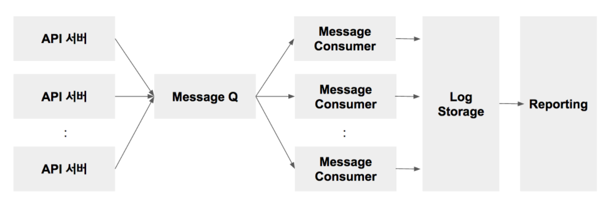

# 21. 로깅과 사용 추적

## **일반적인 로그 시스템 / 리포팅 구조**

| 컴포넌트 | 역할 | 솔루션 |
| --- | --- | --- |
| API 서버 | 로그를 클라이언트로부터 수집하고 데이터 정제 | node.js, ruby, php 등 일반적인 웹 서버 |
| Message Q | 로그 저장소가 순간적으로 많은 트래픽을 감당할 수 없는 경우가 많기 때문에, 중간에 MQ 를 넣어서 들어오는 로그를 저장하며 완충 | Kafka (대량 큐), AWS SQS or 구글Pub/Sub (클라우드 큐), Rabbit MQ (일반적인 큐) |
| Message Consumer | MQ 로 부터 로그를 Message Consumer 가 순차적으로 읽어서 Log Storage에 저장 | Multi Thread(or Process) + Timer 를 조합하여 메시지를 폴링 방식으로 읽어오는 어플리케이션 |
| Log Storage | 로그 저장소 | Hadoop, HBase (하둡) Drill,Druid와 (SQL 기반 빅데이터 플랫폼) Elastic Search |
| Reporting | 저장된 로그는 Reporting 툴을 이용하여 시각화 | Kibana, Zeppelin, Jupyter |
- 로그수집 아키텍처
    - **Google Cloud Logging, AWS, azure, ELK stack, Reference Architecture 정리 :** [https://kic1.tistory.com/147](https://kic1.tistory.com/147)
    - **ELK Stack** : [https://www.elastic.co/guide/kr/logstash/current/introduction.html](https://www.elastic.co/guide/kr/logstash/current/introduction.html)
    - **Graylog** : [https://www.graylog.org/](https://www.graylog.org/)
    - Apache **Flume :** [https://flume.apache.org/](https://flume.apache.org/)

 

## **중앙 집중식 로깅**

- MSA에서는 각각의 마이크로서비스가 분산 환경에서 운영되기에,
    
    각 서비스에서 발생한 로그 파일들은 파편화되어, 트랜잭션을 처음부터 끝까지 순서대로 추적하는 것이 불가능해져서 로그의 출처에 상관없이 `모든 로그를 중앙 집중적으로 저장 및 분석`해야한다.
    
    - 서비스 실행 환경에서 분리하여 관리
- 로컬 장비의 디스크 공간을 사용하지 않고, 로컬 I/O나 디스크 쓰기 블로킹이 없다.
- 각 로그 메시지엔 아래 내용이 포함되어야 한다
    - **메시지**
    - **컨텍스트**
        - 타임스탬프, IP 주소, 사용자 정보, 처리 상세정보(서비스, 클래스, 함수 등), 로그 유형, 분류 등의 정보를 담고 있어야 함
    - **상관관계 ID (correlation ID)**
        - 서비스 호출 사이에서 추적성을 유지하기 위해 사용됨
- 추가적인 내용
    - [https://bravenamme.github.io/2021/01/28/elk-stack/](https://bravenamme.github.io/2021/01/28/elk-stack/)

 

### 로그 스트림

마이크로서비스가 만들어내는 **로그 메시지의 스트림**

- Log4j(메세지 스트리밍), DB 로그, Network 로그 등
    - Log4j : 애플리케이션 로그를 캡처 및 저장하기 위해 사용되는 로깅 유틸리티

### 로그 적재기

**로그 메시지를 수집**하여**,** 수집된 로그를 다른 종단점으로 보낸다.

- Logstash, Fluentd, Logspout
    - Logstash : 중앙화된 로깅 및 분석을 위한 도구
    - [Fluentd](https://www.fluentd.org/architecture) : `LogSpout` 와 마찬가지로 `Logstash` 와 매우 유사하지만 도커 컨테이너 기반 환경에서는 `LogSpout` 이 더 적합함

### 로그 스트림 처리기

- 신속한 의사 결정에 필요한 **실시간 로그 이벤트를 분석**한다.
    - 알람 공지 및 대시보드로 정보 전송 등
- 자체 치유 시스템(self-healing system)에서는 **스트림처리기가 문제점을 바로잡는 역할을 수행**하기도 한다.
    - e.g.) 특정 서비스 호출에 대한 응답으로 404 오류가 지속적으로 발생하는 경우
- kafka, apache flume, spark streaming, storm

### 로그 저장소
- **모든 로그 메시지가 저장**되며, 로그 메세지는 인덱싱되어 **검색 가능한 형식으로 저장**된다.
    - ElasticSearch : 실시간로그 저장
    - HDFS (NoSQL DB) : 아카이브된 로그 메세지 저장 - 대용량
    - MongoDB, Cassandra : 요약 데이터 저장

### 로그 대시보드

- **로그 분석 결과를 그래프나 차트로 표현**해준다.
- 운영, 관리 조직에서 사용
- Kibana, Graphite, Grafana

 

## **로그 데이터 활용**

### **개발 영역**
- 버그 혹은 크래시율 **수집** 및 **상시 트래킹**
- 이슈 발생 후 **롤백 및 대응** 등에 대한 **의사결정 판단의 근거로 활용**
- 특정 기능에 대한 **사용성 진단**

### **마케팅 영역**
- 마케팅 채널별 **ROI 진단** 및 **비용 최적화**
- **배너/프로모션/이벤트 효과 측정**
- 유저 Segmentation, Targeting

### **기획/디자인 영역**
- 시나리오 / 기능 / 디자인에 대한 **성과 측정 및 개선** (A/B 테스트)
- 유저 Journey **경로 분석 및 이탈 구간 개선** (UX/UI 최적화)
- 유저 Persona 구축 (with 리서치) 및 **신규 기능 Ideation**

### **기타 영역**
- **영업 및 CS 관련 대응**
- **사업 및 투자 성과 진단**